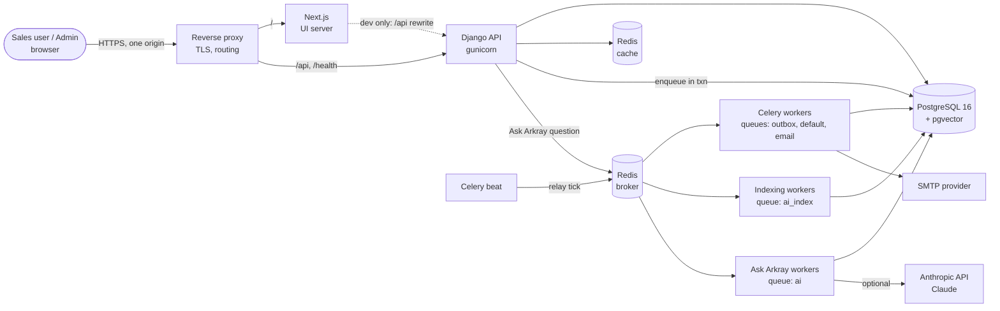
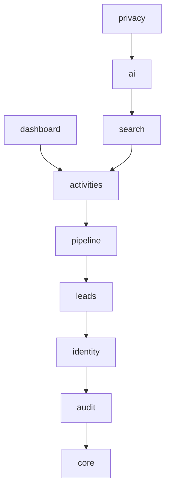
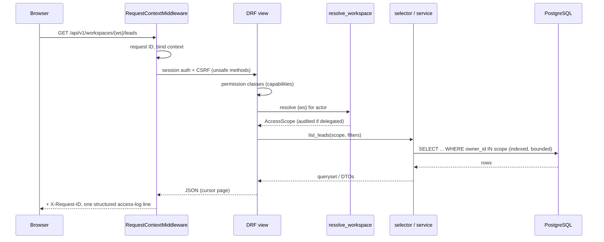

# Architecture

Arkray CRM is a sales CRM for a single organisation. Sales users manage their own leads,
pipeline and activities; administrators manage users and can open any user's CRM
workspace. **Ask Arkray** answers natural-language questions over the data the asker is
allowed to see.

This document is the entry point. Details live in the linked documents and ADRs.

## Quality goals (in priority order)

1. **No cross-user data leakage.** Every read path (API, search, dashboard, AI) is scoped
   server-side by the same mechanism. ([authorization.md](authorization.md))
2. **Correct numbers.** Pipeline values, counts and dates come from database aggregates on
   `NUMERIC` columns, never from an LLM or floating point.
3. **The CRM keeps working when non-core dependencies fail** — AI provider, embeddings,
   email, Redis, Celery. ([reliability.md](reliability.md))
4. **Maintainable by future engineers** — boring technology, clear module boundaries,
   enforced by tooling rather than convention alone.
5. **Fast and bounded** — no unbounded queries, N+1s, or unbounded queues.

## Principles

- **Modular monolith** ([ADR-0001](adr/0001-modular-monolith.md)). One deployable, one
  database, strict internal module boundaries (checked by `import-linter`). No
  microservices until a measured need exists.
- **PostgreSQL is the source of truth.** Integrity lives in the schema (FKs, CHECK and
  UNIQUE constraints, triggers for append-only tables), not only in Python.
- **Deny by default.** DRF's global permission is `DenyAll`; every endpoint opts in
  explicitly and is listed in the authorization matrix.
- **Side effects are asynchronous and durable** — written to a transactional outbox in the
  same transaction as the business change ([ADR-0006](adr/0006-transactional-outbox.md)).
- **The LLM is an untrusted component.** It never gets database access or a way to widen
  scope; it only chooses among server-side tools already bound to the caller's scope
  ([ADR-0008](adr/0008-ask-arkray-hybrid-rag.md)).
- **Measure before optimising.** Indexes follow documented query patterns; caching is
  added only where measurement justifies it.

## System context



- The browser talks to **one origin**. `/api/*` and `/health/*` go to Django, everything
  else to Next.js. Session cookies are therefore first-party and no CORS is configured.
- Only Django and the Celery workers hold database credentials. Next.js holds no secrets.
- Ask Arkray's embeddings are computed inside the deployment (a pinned open model in the
  workers); the only external AI service is the optional language model, called only from the
  `ai` workers, never from a web request ([ADR-0023](adr/0023-ask-arkray-implementation.md)).
- Redis plays two separate roles: an optional **cache** (failure-tolerant) and the Celery
  **broker** (failure means background work waits in PostgreSQL). Production runs them as
  separate instances.

## Backend modules

| Module | Responsibility | Phase |
|---|---|---|
| `core` | Shared kernel: base models, `AccessScope`, transactional outbox, in-transaction domain events, keyset pagination, idempotency records, text normalisation and search-input rules, search ranking (the bounded two-pass window), business days, request context, structured logging, error envelope, health probes, fail-fast cache connections | 0 (2: events, keyset, idempotency, text; 4: business days; 7: ranking) |
| `audit` | Append-only security/compliance audit trail | 0 |
| `identity` | Users, roles → capabilities, authentication, invitations, admin user management, **workspace resolution** | 0 (model, policy, workspaces) / 1 |
| `leads` | Leads (the central prospect record; no Company/Product entities), configurable statuses and sources, ownership and reassignment, archive, bounded search, duplicate assistance ([leads.md](leads.md)) | 2 |
| `pipeline` | Pipelines, configurable stages, opportunities (owned by their lead's owner), the one stage-transition operation, won/lost/reopen, append-only stage history, lead conversion, **the** pipeline value / weighted pipeline definitions, the Kanban board ([pipeline.md](pipeline.md)) | 3 |
| `activities` | Tasks, meetings, notes (one extensible activity model, every activity about a lead, current work owned by the lead's owner), their lifecycle (complete, cancel, reopen), the lead and opportunity **timeline**, the last-contact rule for completed meetings, **the** activity figures for the dashboard ([activities.md](activities.md)) | 4 |
| `dashboard` | The dashboard and Admin Home: a read-only composition of the owning modules' authoritative figures (lead figures, pipeline value and weighted pipeline, task and meeting figures) and short lists, in one snapshot, for any workspace; no tables, cache or formulas of its own ([dashboard.md](dashboard.md)) | 5 |
| `search` | Global search: one bounded, read-only search of a workspace's leads, opportunities, tasks, meetings and notes, composed from each module's own `selectors.search` (the scope applied before any word is matched), grouped by kind; no tables of its own ([search.md](search.md)) | 7 |
| `ai` | Ask Arkray: the deterministic router, scope-bound read-only tools over the modules' selectors, authorised semantic retrieval (pgvector, owner pre-filter, live re-verification), outbox-driven indexing of each module's knowledge documents, the bounded Claude tool loop on its own queue, answer assembly with numeric grounding, conversations ([rag-architecture.md](rag-architecture.md)) | 8 |
| `privacy` | Personal-data operations an administrator runs on request: erasure of a lead (`manage.py erase_lead`) across every module and Ask Arkray's derived data, in one transaction ([privacy.md](privacy.md)); no tables, no API | 11 |

The suggested separate `users` module was folded into `identity`: user management and
authentication share one model and one policy, and splitting them would create two owners
of the `User` table.

### Dependency rules



- A module may import only modules **below** it. `core` imports no other Arkray module.
  This is enforced by `import-linter` (`uv run lint-imports`); each phase adds its module to
  the contract in `backend/pyproject.toml`.
- Cross-module calls go through the target module's **`selectors`** (reads) and
  **`services`** (writes). Never write another module's tables directly. One documented
  exception: `privacy`'s erasure redacts the lead's, opportunities' and activities' text
  and deletes Ask Arkray's derived rows itself, in one transaction, because no service may
  edit archived records and the redaction must be atomic across modules. It still publishes
  `LeadArchived` (the timeline entry, re-indexing) like an archive, and it holds the
  erasure lock Ask Arkray stores answers under (the whole-software audit found both gaps).
  Within the layers, nothing yet *enforces* "selectors and services only" (for example
  `ai.tools` reads `Lead` for the organisation's breakdown): import-linter checks the layer
  order, a narrower contract is future work.
- Lower modules never import upper ones. When an upper module must react to a lower
  one's change, it subscribes to the lower module's **domain events**, which run inside
  the same transaction ([ADR-0017](adr/0017-in-transaction-domain-events.md)); slow or
  external work (for example "re-index this lead for Ask Arkray") is then written to the
  **outbox** by the subscriber. `leads` never imports `pipeline`, `activities` or `ai`.
  Phase 3's `pipeline` subscribes to `LeadReassigned` (open opportunities follow the lead)
  and to `LeadStatusChanged`/`LeadCreated` (a lead can't become Converted without an
  opportunity; a subscriber may veto by raising). Phase 4's `activities` subscribes to
  `LeadReassigned` after the pipeline (current work follows the lead; lock order lead →
  opportunities → activities) and to the lead and opportunity events to write the
  timeline. A completed meeting advances the lead's last contact through
  `leads.services.record_contact`. Phase 5's `dashboard` only reads: it calls the
  `leads`, `pipeline` and `activities` selectors and defines no figure itself. Phase 7's
  `search` sits beside it (independent siblings in the import-linter contract): each
  module decides what of its own records is searched (`selectors.search`, ranked by
  `core.ranking`), and `search` only composes them. Phase 8's `ai` sits on top: it reads
  through every module's selectors (each module also decides what of its records may be
  embedded: `selectors.knowledge_documents`), and reacts to their domain events only by
  writing outbox work (`ai.subscribers`); nothing imports `ai`.
- `audit` stores actors and targets as plain identifiers, so it sits *below* `identity` and
  its history is independent of the records it describes.

### Inside a module

```
arkray/<module>/
  models.py       tables and constraints (persistence only)
  selectors.py    read queries; every CRM selector takes an AccessScope
  services.py     write use cases: transaction, invariants, audit, domain events, outbox
  api/            serializers.py, views.py, urls.py — thin HTTP adapters
  handlers.py     outbox handlers (registered from AppConfig.ready)
  tests/
```

Business rules live in services, not in serializers or views, so the API, CSV imports,
background jobs and Ask Arkray tools all share one implementation of each rule.

## Request lifecycle



## Frontend

- Next.js 16 App Router, TypeScript strict, Tailwind CSS v4 design tokens.
- Authenticated pages are client-rendered against the same-origin API; the session cookie
  is HTTP-only and never visible to JavaScript ([ADR-0003](adr/0003-session-authentication.md)).
- **The URL is the source of truth for the workspace** ([ADR-0010](adr/0010-frontend-workspace-routing.md)):
  `/leads` is the viewer's own workspace (organisation-wide for admins), while
  `/admin/users/{id}/leads` is that user's. The same module views render in every workspace
  and only change the API path (`/api/v1/workspaces/{me|all|id}/...`). A path below
  `/admin/users/` whose id is not a user id names no workspace, so it renders "not found",
  never a fallback to other records. The selected-user frame renders a page only when the
  URL's user and the layout's user agree ([admin-user-workspace.md](admin-user-workspace.md)).
- The UI decides what to *show* from the viewer's capability list. The API enforces
  everything again; hiding a button is never the security control.

## Cross-cutting concerns

| Concern | Where |
|---|---|
| Authentication, authorization, admin workspace | [authorization.md](authorization.md), [admin-user-workspace.md](admin-user-workspace.md) |
| Background work, retries, timeouts, degradation | [reliability.md](reliability.md) |
| Logging, correlation, health, metrics, tracing | [observability.md](observability.md) |
| Threats and controls | [security.md](security.md) |
| API shape | [api-conventions.md](api-conventions.md) |

## Decision records

| ADR | Decision |
|---|---|
| [0001](adr/0001-modular-monolith.md) | Modular monolith on Django + DRF |
| [0002](adr/0002-postgresql-data-integrity.md) | PostgreSQL as source of truth; data-integrity conventions |
| [0003](adr/0003-session-authentication.md) | HTTP-only session cookies on a single origin |
| [0004](adr/0004-capability-authorization-and-scoping.md) | Capability-based, deny-by-default authorization with owner scoping |
| [0005](adr/0005-admin-workspace-without-impersonation.md) | Admin user workspace as scoped, audited access (no impersonation) |
| [0006](adr/0006-transactional-outbox.md) | Transactional outbox + Celery, one retry layer, bounded in-flight |
| [0007](adr/0007-append-only-history.md) | Append-only audit and history enforced in PostgreSQL |
| [0008](adr/0008-ask-arkray-hybrid-rag.md) | Ask Arkray: deterministic tools + authorized semantic retrieval |
| [0009](adr/0009-unified-activity-model.md) | One activity model for tasks, meetings and notes |
| [0010](adr/0010-frontend-workspace-routing.md) | Next.js with URL-derived workspaces and shared module views |
| [0011](adr/0011-single-tenant.md) | Single-tenant deployment |
| [0012](adr/0012-business-day-time-zone.md) | "Today" is computed in the organisation's time zone |
| [0013](adr/0013-account-lifecycle-and-one-time-tokens.md) | Explicit account lifecycle; stored, hashed one-time account tokens; session epochs |
| [0014](adr/0014-durable-login-throttling.md) | Durable login throttling with per-browser budgets |
| [0015](adr/0015-leads-domain-model.md) | Leads as the central record; configurable statuses and sources by immutable key |
| [0016](adr/0016-composite-keyset-pagination.md) | Composite, NULL-aware keyset pagination with signed cursors |
| [0017](adr/0017-in-transaction-domain-events.md) | In-transaction domain events for cross-module reactions |
| [0018](adr/0018-pipeline-integrity-by-composite-keys.md) | Pipeline integrity by composite foreign keys; one lock order |
| [0019](adr/0019-lead-conversion.md) | Lead conversion creates an opportunity; "Converted" requires one |
| [0020](adr/0020-activity-integrity.md) | Activities: lead-bound, owned by the lead's owner while current, guarded by composite keys |
| [0021](adr/0021-materialized-timeline.md) | The timeline is an append-only table written in-transaction; visibility is decided when read |
| [0022](adr/0022-global-search.md) | Global search: authorised, grouped lexical search with a bounded two-pass window |
| [0023](adr/0023-ask-arkray-implementation.md) | Ask Arkray as built: local embeddings, answers on their own queue, a deterministic fast path |

## Delivery phases

Each phase ends with migrations, tests (including authorization tests), lint, type and
security checks, and a PASS/FAIL report. No phase starts while critical tests fail.

| Phase | Scope |
|---|---|
| **0** | (**done**) Architecture, docs, ADRs, repo, dev environment; foundation code: settings, User model, capability policy, `AccessScope` + workspace resolution, audit (DB-enforced append-only), transactional outbox, logging/request IDs, error envelope, health probes, fail-fast cache, architecture guard tests, frontend shell + workspace routing + API client |
| **1** | Authentication (login/logout/me, CSRF, DB-backed login throttling, session timeouts), password reset, invitation flow, admin user management API + UI, first authorization matrix entries (**done**) |
| 2 | (**done**) Leads: configurable statuses/sources, CRUD, assign/reassign, archive, filters/sort/search, keyset pagination, duplicate assistance, admin workspaces, cross-user IDOR suite. Notes and the lead timeline moved to Phase 4; CSV import/export deferred ([leads.md](leads.md)) |
| 3 | (**done**) Pipeline: configurable pipelines/stages, opportunities, Kanban (drag and drop + keyboard Move menu, stage tabs on phones), one stage-transition operation, won/lost/reopen, append-only stage history, lead conversion, open opportunities following lead reassignment, exact pipeline value / weighted pipeline, cross-user and aggregate-leakage suite, real-concurrency and lock-order tests, 300k-opportunity benchmark ([pipeline.md](pipeline.md)) |
| 4 | (**done**) Activities: tasks, meetings and notes in one table (CHECK-enforced per type), complete/cancel/reopen as explicit operations, current work following lead reassignment (deferred composite key), immutable authorship, last contact from completed meetings (MAX), the append-only lead/opportunity timeline (backfilled from the audit trail and stage history), the Activities page, the activity figures for Phase 5, cross-user and timeline-leakage suite, real-concurrency and lock-order tests, 403k-activity benchmark ([activities.md](activities.md)) |
| 5 | (**done**) Dashboard and Admin Home: total leads, new leads today (Asia/Kolkata business day), pipeline value and weighted pipeline (Phase 3's definitions), meetings and tasks (Phase 4's), today's newest leads with their assigned user, the next meetings and open tasks; own, selected-user and organisation-wide workspaces; one endpoint, six bounded queries in one snapshot, no cache; workspace-isolated frontend; aggregate-leakage suite; 1M-lead / 2M-activity benchmark ([dashboard.md](dashboard.md)) |
| 6 | (**done**) Admin user workspace end to end: a user's name opens their Dashboard; Pipeline, Leads and Activities (lists, details, create and edit) in their workspace through the same views and API; a banner naming the subject, their status and the signed-in actor; workspace-aware navigation and "not found" links; fail-closed URL parsing and canonical workspace URLs; deactivated and invited users read-only for new work; cache isolation, slow-response, Back/Forward and failure suites with marked records; selected-user authorization matrix, object substitution, actor-vs-subject and audit-window tests. A per-user statistics table on the Users page was deliberately not built (per-user CRM figures would cost a query per row; the Dashboard is one click away) ([admin-user-workspace.md](admin-user-workspace.md)) |
| 7 | (**done**) Global search: one endpoint per workspace (`/workspaces/{ws}/search`), leads, opportunities, tasks, meetings and notes matched by trigram-indexed substrings inside the scope (authorization before matching), grouped results ranked by match tier then recency, at most 5 per kind, a bounded two-pass window (recent pass + gated older pass), read-only, nothing logged or stored; shell search dialog (Ctrl/⌘K, accessible combobox, workspace-keyed cache, results that stay in the workspace); cross-user marker suite; 1M-lead / 2M-activity benchmark ([search.md](search.md)) |
| 8 | (**done**) Ask Arkray: a deterministic router for structured questions; 11 scope-bound read-only tools over the modules' selectors; authorised semantic retrieval (pgvector, owner pre-filter, live re-verification, hash check; chunks store no text); local embeddings (bge-small-en-v1.5, pinned and verified); outbox-driven, idempotent, rebuildable indexing with reconciliation; questions answered on their own Celery queue with a bounded Claude tool loop, circuit breaker and retrieval fallback; numeric grounding and safe typed answers; actor-and-workspace-bound conversations; the Rahul/Priya secret suite, prompt-injection, stale-vector and outage tests; Ask Arkray page with workspace-isolated state ([rag-architecture.md](rag-architecture.md), [ADR-0023](adr/0023-ask-arkray-implementation.md)) |
| 9 | Security and audit hardening: CSP, audit viewer, rate-limit tuning, threat-model review |
| 10 | Performance, reliability, observability: metrics, tracing, load tests, alerting |
| 11 | Production readiness: manifests, backups/DR drill, runbooks, E2E suite |
