# Authentication and authorization

Every security boundary is enforced by the backend. The frontend only decides what to
display.

## Authentication

**Built in Phase 1** (the design decisions are in [ADR-0003](adr/0003-session-authentication.md),
[ADR-0013](adr/0013-account-lifecycle-and-one-time-tokens.md) and
[ADR-0014](adr/0014-durable-login-throttling.md)). Code:
[`identity/authentication.py`](../backend/arkray/identity/authentication.py),
[`sessions.py`](../backend/arkray/identity/sessions.py),
[`throttling.py`](../backend/arkray/identity/throttling.py),
[`services.py`](../backend/arkray/identity/services.py).

### Mechanism

Server-side **Django sessions in PostgreSQL** with an HTTP-only cookie on a single origin.
No bearer token is ever exposed to JavaScript, localStorage or sessionStorage.

| Setting | Value | Why |
|---|---|---|
| `arkray_session` cookie | `HttpOnly`, `Secure` (production), `SameSite=Lax` | unreadable by scripts; not sent on cross-site subresource requests |
| Session storage | PostgreSQL (`django_session`) | a Redis outage never signs anyone out |
| Absolute lifetime | 12 h (`SESSION_COOKIE_AGE_S`); the expiry is pinned at sign-in, and activity never extends it | bounds the value of a stolen session |
| Idle timeout | 2 h (`SESSION_IDLE_TIMEOUT_S`); activity is recorded at most every 5 min | same, without a database write per request |
| Session key | always new on sign-in, including when the same user signs in again | no session fixation |
| Revocation | the session auth hash covers the password hash **and** `User.session_epoch`; Django re-checks it, and rejects inactive users, on every request | deactivation, password change and email change end sessions on the very next request, and they stay dead after reactivation |
| CSRF | the readable `arkray_csrftoken` cookie is echoed in `X-CSRFToken` (double submit), and `Origin` is checked against `CSRF_TRUSTED_ORIGINS`. `ApiView` enforces this on **every** unsafe request, signed in or not (DRF alone skips anonymous requests). | login CSRF and cross-site actions are refused |
| Unauthenticated | `401 not_authenticated` with `WWW-Authenticate: Session realm="arkray"` | clients can tell "sign in" (401) from "not allowed" (403) |
| Caching | every API response is `Cache-Control: no-store` | personal data is never cached |
| Password hashing | Argon2id (PBKDF2 accepted for upgrade) | |

A session without valid timestamps is treated as expired: deny by default.

### Endpoints

| Endpoint | Access | Behaviour |
|---|---|---|
| `GET /api/v1/auth/csrf` | public | sets the CSRF cookie (204) |
| `POST /api/v1/auth/login` | public | `{email, password}` → the viewer. Every failure returns the identical `400 invalid_credentials` "Invalid email or password.": unknown email, wrong password, invited (no password yet), deactivated, malformed email. The hasher runs in every case, against a decoy hash when there is no usable one, so timing reveals nothing either. Throttled attempts get `429` with `Retry-After`. |
| `POST /api/v1/auth/logout` | public (idempotent) | deletes the session; audited when a user was signed in |
| `GET /api/v1/auth/me` | signed in | `{id, email, first_name, last_name, full_name, role, role_label, capabilities[]}` |
| `POST /api/v1/auth/password/change` | signed in | `{current_password, new_password}`; throttled like sign-in; keeps this session (new key), ends all others, and voids any outstanding password-reset link |
| `POST /api/v1/auth/password-reset` | public | `{email}` → always `202` "If an eligible account exists, password reset instructions have been sent." |
| `POST /api/v1/auth/password-reset/confirm` | public | `{token, new_password}` → 204; every session ends; the user then signs in |
| `POST /api/v1/auth/invitations/verify` | public | `{token}` → `{email, first_name}` for a valid invitation (POST, so the secret never enters a URL on the API side) |
| `POST /api/v1/auth/invitations/accept` | public | `{token, password}` → activates the account; the user then signs in |

Invalid, used, superseded, revoked and expired links all get one answer:
`400 invalid_token` "This link is invalid or has expired. Ask for a new one."

### Sign-in throttling

Durable, PostgreSQL-backed ([ADR-0014](adr/0014-durable-login-throttling.md)), so it keeps
working during a Redis outage (tested). DRF's Redis-backed limits (`anon` 60/min, `auth`
20/min) sit in front as a fail-open first layer.

| Rule | Policy |
|---|---|
| Key | keyed HMAC of the *submitted*, normalised email, so unknown emails are throttled exactly like real ones and no email is stored |
| Per account and browser | 5 failures in 15 min → locked 1 min, doubling with each further failure, **capped at 15 min**. A browser that has signed in to the account before (signed `arkray_login_device` cookie, HttpOnly, `SameSite=Strict`, path `/api/v1/auth/`, 90 days) has its **own** budget, so an attacker can't lock the owner out of their usual browser. Unrecognised browsers share one budget. |
| Per source | 50 failures in 15 min → unrecognised browsers from that source are blocked until the window moves (catches password spraying). The source is the trusted-proxy-aware client IP; an IPv6 address counts as its /64 (one subscriber); an unknown address (for example a proxy writing `unknown`) shares one bucket, so it fails closed. **Trusted browsers are exempt**, so a noisy neighbour behind the same office NAT can't lock the owner out. |
| Refused attempts | refused **before** the password is checked and not recorded: no oracle, bounded storage |
| Atomic reservations | each attempt first *reserves* a failure in a short transaction that holds advisory locks on the account and the source, checks both budgets and inserts the row; only then is the password checked (outside any transaction), and a correct password deletes the reservation. Parallel bursts can't exceed a budget, and nobody is refused just because another attempt is in flight. |
| Resets | a successful sign-in clears that browser's bucket; a completed reset or activation clears the account's buckets |
| Password-reset requests | 20 per source per hour (durable, reserved atomically like sign-in); at most 3 reset emails per account per hour (in the job; suppression is audited) |
| Key rotation | identifiers and trusted-browser cookies made with a key in `SECRET_KEY_FALLBACKS` still count and still match, so rotating the key neither lifts lockouts nor untrusts browsers |
| Audit | crossing a threshold is audited once (`auth.login_throttled`, target = identifier prefix, never the email) |
| Housekeeping | evidence older than 24 h is purged hourly (`identity.housekeeping`, which also clears expired sessions) |

### Account lifecycle

```mermaid
stateDiagram-v2
    [*] --> invited: admin creates user
    invited --> active: user accepts invitation (sets password)
    active --> deactivated: admin deactivates
    invited --> deactivated: admin deactivates (link revoked)
    deactivated --> active: admin reactivates (had a password)
    deactivated --> invited: admin reactivates (never activated; new invitation sent)
```



Every rule is a CHECK constraint on `identity_user` ([database.md](database.md#identity_user)).
Users are **never deleted**: foreign keys are `PROTECT`, and history and ownership
references stay intact.

### Invitation flow (admins never choose or see passwords)

```mermaid
sequenceDiagram
    participant A as Admin
    participant API as Django
    participant DB as PostgreSQL
    participant W as Worker
    participant U as New user
    A->>API: POST /admin/users {first_name, last_name, email, role}
    API->>DB: txn: user (invited, unusable password), token row (pending, no secret yet),<br/>outbox identity.deliver_account_token, audit user.created + user.invitation_created
    API-->>A: 201 (invited; email not yet sent)
    W->>DB: claim outbox event; lock token; mint 256-bit secret; store SHA-256 digest; commit
    W->>U: email with APP_BASE_URL/activate/<secret> (72 h, one use)
    W->>DB: sent_at = now
    U->>API: POST /auth/invitations/accept {token, password}
    API->>DB: txn: lock user, lock token, re-validate, set password, status active,<br/>token used, audit user.activated
```

- The secret exists only in the worker's memory and in the email, never in a web
  request, the outbox payload, audit or logs (tested).
- If the email provider fails, user creation has already committed. The outbox retries
  with backoff (8 attempts), and each retry mints a new secret, which invalidates the
  undelivered one. The admin sees "Sending invitation…" until `sent_at` is set.
- **Resend** revokes the pending invitation and issues a new one (at most once a minute per
  user). The database allows at most one pending invitation per user.
- Deactivating an invited user revokes the link. Reactivating a user who never activated
  sends a fresh invitation.

### Password reset

Request, then job, then email. The request does constant work: it records the request
for per-IP throttling and enqueues `identity.password_reset_requested` whatever the email.
The job issues a token only for an **active** account (at most 3 per hour) and hands it to
the same delivery job as invitations (1 h, one use). A newer request supersedes the older
link. Confirming sets the password, increments `session_epoch` (ending every session) and
clears sign-in lockouts; the user then signs in with the new password. This is audited as
`auth.password_reset_issued` (system) and `auth.password_reset_completed` (user).

### Email canonicalisation

The email is the login identity. `normalize_email`: surrounding whitespace is stripped and
the **whole address is lower-cased**, so `User@Example.com` and `user@example.com` are one
identity. A CHECK constraint (`email = lower(email)`) plus the unique index enforce this
even for writes that bypass the ORM. Only **ASCII** addresses are accepted at the API, so
Unicode look-alikes (an `admin@…` spelled with a Cyrillic "а") can't become a second
identity. Nothing provider-specific is done: no Gmail dot or `+tag` stripping.

### Password policy

Length and known-bad passwords rather than composition rules (NIST SP 800-63B): at
least 12 characters, at most 128, not in Django's list of 20,000 common passwords, not
entirely numeric, not similar to the user's email or name, and not containing the product
name. Enforced through `AUTH_PASSWORD_VALIDATORS` on activation, reset and change, with
the reasons returned per field. Passwords are never trimmed, logged or audited.

### Deactivation

`POST /admin/users/{id}/deactivate`: status becomes `deactivated`, `is_active=false`,
`session_epoch` is incremented and pending links are revoked, all in one transaction.
Existing sessions fail on their next request (401) and **stay dead after a
reactivation**. Records, history and audit are untouched. The action is idempotent.
Admins can't deactivate themselves, and the system always keeps at least one active
administrator.

### User administration rules

- Every write takes one advisory lock, and the acting administrator is re-read under it.
  An admin who was deactivated or demoted a moment ago can't complete an action, and two
  admins deactivating each other can't leave zero administrators (tested with real
  concurrency).
- Editable via `PATCH` (with the current `version`, or 409): first name, last name, role.
  Anything else, including `email`, `status`, `is_active`, `password`, `is_superuser` and
  `capabilities`, is rejected with 400 (unknown field). Role changes are audited with
  before and after values, admins can't change their own role, and demotion takes effect on
  the next request.
- **Email change** is its own action (`POST /admin/users/{id}/change-email`, with the
  version): uniqueness is checked (409), `session_epoch` is incremented (the user is signed
  out everywhere), pending reset links are revoked, invited users get a fresh invitation at
  the new address, and active users' previous address is notified. It is audited with old
  and new values. Changing **your own** email also requires your current password
  (throttled like sign-in), so a hijacked session can't become a permanent takeover.
- A manager who is deactivated or loses `users.manage` takes their **pending invitations**
  with them: they're revoked in the same transaction (counted in the audit event), so nobody
  can leave a pre-approved account behind. The invited user shows "No active invitation"
  until another admin resends.
- The rules check capabilities (`users.manage`) through `roles_with()`, never role names.

MFA (TOTP) is a planned extension. Neither the capability model nor the session design needs
to change for it.

## Authorization model

Four layers, each deny-by-default:

```
1. Authentication     session → request.user (active users only)
2. Capability         endpoint declares the capability it needs      → 403
3. Scope              {workspace} URL segment → AccessScope          → 404 if not allowed
4. Object             every lookup goes through scope.apply(queryset) → 404 if outside scope
   (+ Mutation rules  services decide which fields and transitions the actor may change)
```

### Roles → capabilities (built)

Code checks **capabilities**, never role names
([`identity/policy.py`](../backend/arkray/identity/policy.py)).

| Capability | Meaning | admin | sales_user |
|---|---|:-:|:-:|
| `crm.access_own` | work in one's own workspace | ✓ | ✓ |
| `crm.view_all` | organisation-wide CRM reads (workspace `all`) | ✓ | |
| `workspace.view_any` | open any user's workspace (audited) | ✓ | |
| `crm.assign_any` | assign or reassign records to any user | ✓ | |
| `crm.manage_any` | create, edit and archive records in another user's workspace or organisation-wide (Phase 2) | ✓ | |
| `users.manage` | create, edit, (de)activate, invite users | ✓ | |
| `config.manage` | pipelines, stages, lead statuses and sources | ✓ | |
| `audit.view` | read the audit log | ✓ | |
| `ai.query` | use Ask Arkray within one's own scope | ✓ | ✓ |

- Inactive users, anonymous users and **unknown roles get nothing**.
- Adding a role (for example a *sales manager* who sees a team) means adding one mapping
  entry, plus, if the new role sees other people's data, a new `AccessScope` kind that
  resolves to the team's owner IDs. Endpoints, selectors and Ask Arkray tools don't change
  because they only consume the scope. This is the "additional access explicitly granted"
  extension point.

### `AccessScope` (built)

[`core/access.py`](../backend/arkray/core/access.py) states whose records a request may
touch:

| Kind | Owners | Constructed when |
|---|---|---|
| `SELF` | `{actor}` | workspace `me` (or the actor's own id) |
| `USER` | `{subject}` | an actor with `workspace.view_any` opens `{uuid}` |
| `ORGANIZATION` | all (no filter) | an actor with `crm.view_all` opens `all` |

Invariants are enforced in the constructor. In particular, an empty owner set can never
mean "everyone": organisation-wide access is a separate kind, so a bug that loses the owner
list denies access instead of granting it. `scope.apply(qs, owner_field="owner_id")` is the
one filtering primitive used by selectors, search, dashboard aggregates and Ask Arkray.

Background jobs are the only unscoped readers. They act as the *system*, load records by
id, and never serve responses to users. An Ask Arkray tool is **not** a background job: it
always receives the requesting user's scope.

## Admin → User Workspace (built: resolution and banner endpoint in Phase 0; module views in Phases 2–5; completed in Phase 6)

Requirement: an admin clicks a user's name, lands on `/admin/users/{id}/dashboard`, and
navigates that user's Dashboard, Pipeline, Leads and Activities, with a persistent
"Viewing CRM for: …" banner. Design ([ADR-0005](adr/0005-admin-workspace-without-impersonation.md)):

- **Every CRM endpoint is nested under a workspace**:
  `/api/v1/workspaces/{workspace}/leads`, `…/dashboard`, `…/opportunities/{id}`, etc.
- `resolve_workspace(actor, workspace)`
  ([`identity/workspaces.py`](../backend/arkray/identity/workspaces.py)) turns the segment
  into an `AccessScope`:
  - `me` → SELF;
  - `all` → ORGANIZATION if the actor has `crm.view_all`, otherwise 404;
  - `{uuid}` → USER if the actor has `workspace.view_any` and the user exists (active or
    deactivated), otherwise **404, identical for "exists" and "doesn't exist"**, so it
    can't be used to enumerate users. Only the canonical hyphenated UUID form is accepted
    (`urn:uuid:`, braces, bare hex and similar spellings → 404), so workspace URLs are
    canonical.
- **No impersonation.** The admin stays signed in as themselves. No session, cookie or
  credential of the viewed user is created or touched. Every write records the admin as
  `actor` (and `created_by`) and the viewed user as `subject_user_id` in the audit log.
  Records the admin creates in Rahul's workspace are owned by Rahul.
- **Audit.** Viewing another user's workspace (or `all`) writes a `workspace.accessed`
  audit event at least once per actor/workspace per 15 minutes, and every write is audited
  individually. The window marker is set only **after the audit row commits**, so a request
  that rolls back never suppresses auditing. If the cache that implements the window is
  unavailable, **every** access is audited: the system fails toward more auditing, never less. Every access-log line
  for the request also carries `subject_user_id`.
- **Opening a workspace.** `GET /api/v1/workspaces/{workspace}` resolves the segment (and
  audits delegated access) and returns `{kind, subject: {id, full_name, status}}`, which the
  frontend uses for the "Viewing CRM for" banner. Anything the caller may not open is 404.
- **Frontend reuse.** The same page components render at `/leads` and
  `/admin/users/{id}/leads`; the workspace comes from the URL
  ([ADR-0010](adr/0010-frontend-workspace-routing.md)). The URL is parsed once, the way
  Next.js decodes the route param, and fails closed. The frame renders a page only when the
  URL's user and the layout's user are the same user. User names link to a workspace only for
  viewers with `workspace.view_any`.
- **Deactivated and invited users** stay viewable; new current work can't be given to them
  (lead create: *"This user's account isn't active, so new leads can't be added to their
  workspace."*; opportunities and activities: the deactivated-owner rule). Nothing is
  reactivated or reassigned automatically.
- The whole journey, actor vs subject, cache isolation, errors and query counts:
  [admin-user-workspace.md](admin-user-workspace.md).

## Object-level and mutation rules (built for leads in Phase 2, opportunities in Phase 3 and activities in Phase 4)

- **Writing** anywhere is authorised by one function, `identity.workspaces.authorize_write(actor, scope)`,
  which every CRM service calls before any change: the own workspace (`me`) needs
  `crm.access_own`; another user's workspace or `all` needs **`crm.manage_any`**.
  Being able to *view* a workspace (`workspace.view_any`, `crm.view_all`) never implies
  being able to change it, so a future read-only role (an auditor, a manager who only
  watches) needs no endpoint changes. Refusal is 403: the caller can already see the
  workspace, so nothing is revealed.
- Services receive the `AccessScope` and apply it themselves (lookups, locks), so a
  direct service call (a future import, an Ask Arkray tool) is exactly as constrained
  as an HTTP request (tested).

- **Lookups** always use `scope.apply(Model.objects…)`; a record outside the scope is
  **404**, never 403, so its existence isn't revealed.
- **Activities have no chosen owner either** (Phase 4): an activity is always about a lead
  in the caller's scope (directly or through one of its opportunities) and is created for
  that lead's owner; `created_by` is the actor. Linking to a lead or opportunity outside the
  scope is a 404 identical to a missing one (non-enumerating, tested). A note's text may be
  edited only by its author (403 otherwise); lifecycle changes are explicit actions
  (`/complete`, `/cancel`, `/reopen`, `/archive`, `/restore`).
- **Opportunities have no chosen owner at all** (Phase 3): an opportunity is always
  created for, and owned by, its lead's owner; the lead must be in the caller's scope
  (404 otherwise), and creating one in someone else's workspace needs `crm.manage_any`
  but not `crm.assign_any`, because nothing is being assigned. An `owner` in the payload
  is a 400.
- **Creation:** in `me` the new record is always the actor's (any other `owner` in the
  payload is a 400, identical whether or not that user exists). In `{uuid}` it is always
  that user's; in `all` the actor must choose one. Both need `crm.assign_any` (creating a
  record for someone else *is* an assignment) and an active user whose role works in a
  CRM workspace (`identity.selectors.lock_assignable_user`, which share-locks the user row
  so a concurrent deactivation can't slip in).
- **Assignment / reassignment** requires `crm.assign_any` (sales users can't give records
  away, not even their own), locks the row, requires the current `version`, writes the
  audit entry and publishes the domain event that later phases use to move related records
  and re-index ([leads.md](leads.md#reassignment)).
- **Mass assignment:** serializers declare explicit writable fields. `owner`,
  `created_by`, `status` (state machine), `closed_at`, `version` and timestamps are never
  directly writable; transitions go through action endpoints (`/assign`, `/move`,
  `/complete`).
- **Filters** are allowlisted. An `owner` filter exists only in the `all` workspace and is
  intersected with the scope, never used to widen it.

### Ownership coherence (v1)

Because visibility is owner-based, related open records share an owner:
- an open opportunity's owner equals its lead's owner;
- an open task or scheduled meeting related to a lead is owned by the lead's owner;
- **reassigning a lead** moves, in one transaction: the lead, its notes, its open
  opportunities, its open tasks and its scheduled meetings. Completed or cancelled
  activities and closed opportunities keep their historical owner, because they record who
  did the work.
- **Built for opportunities in Phase 3** and enforced by PostgreSQL: a deferred composite
  foreign key refuses to commit an open opportunity whose owner isn't its lead's owner
  ([ADR-0018](adr/0018-pipeline-integrity-by-composite-keys.md)). Reopening a closed
  opportunity makes it the lead's current owner's, which only someone whose workspace
  includes that owner may do ([pipeline.md](pipeline.md#ownership)).
- **Built for activities in Phase 4**, the same way: open tasks, scheduled meetings and notes
  follow the lead (author unchanged); completed and cancelled tasks and meetings keep their
  owner; a deferred composite key refuses current work left with anyone but the lead's owner
  ([ADR-0020](adr/0020-activity-integrity.md), [activities.md](activities.md#lead-reassignment)).

For open records this guarantees a user never sees a record whose parent they can't
open. Closed records a user keeps after the parent moved on (a won opportunity whose lead
was reassigned) render the parent as restricted (below). When teams or record sharing are
introduced, this rule is relaxed together with the new scope kind, not before.

### Related records and timelines

- A serializer that embeds a related record (for example an activity's lead) renders it
  only if it is visible in the same scope; otherwise it renders `{"id": null, "restricted": true}`.
  Built in Phase 3 for an opportunity's lead (tested: the previous owner of a reassigned
  lead sees their won opportunity but not the lead's name) and in Phase 4 for an activity's
  lead and opportunity and a timeline entry's opportunity.
- **Aggregates are scoped like rows** (Phase 3): every total, count and per-stage value is
  computed from `scope.apply()` first, in the selectors, so a sum can never include a
  record the caller couldn't list.
- **Timelines** (Phase 4, [ADR-0021](adr/0021-materialized-timeline.md)): a lead's timeline is
  readable by whoever can see the lead (404 otherwise), an opportunity's by whoever can see
  the opportunity. Lead events are shown to whoever sees the lead; an entry about an activity
  or an opportunity only while that record is visible in the same scope and not archived
  (after a reassignment the new owner doesn't see the previous owner's completed meetings or
  closed opportunities). Snapshots hold safe values only (status and stage names, owner ids,
  meeting times); titles and note text come from the live, visible record, as previews.
- **Counts are scoped like rows** for activities too: the activity summary is computed from
  `scope.apply()` first and is identical whether or not other users have records.
- **The dashboard** (Phase 5) adds no authorization of its own: `GET …/{workspace}/dashboard`
  resolves the workspace like every CRM route and calls the owning modules' selectors with
  that scope, so every figure and list is computed from `scope.apply()` first. A sales user
  sees their own figures; `all` (with `crm.view_all`) is the Admin Home; `{uuid}` (with
  `workspace.view_any`) is exactly that user's figures, audited once per window like any
  delegated access ([dashboard.md](dashboard.md#workspaces)).

## Ask Arkray alignment

Ask Arkray gets the same `AccessScope` as the page it is asked from, and its tools call the
same scoped selectors. The model never receives a scope parameter it could alter, and
retrieved vector hits are re-verified through `scope.apply()` before their text is used.
See [rag-architecture.md](rag-architecture.md#security-invariant).

## How this is verified

| Guard | Where |
|---|---|
| DRF default permission is `DenyAll` | `tests/architecture/test_authorization_baseline.py` |
| Every `/api/` route is in the authorization matrix (and no stale entries) | same file + `tests/authz_matrix.py` |
| Role → capability matrix is exact; unknown roles and inactive users get nothing | `identity/tests/test_policy.py` |
| Workspace resolution: own, other, `all`, malformed, enumeration-safe, audited, cache-outage behaviour, deactivated users | `identity/tests/test_workspaces.py` |
| `AccessScope` invariants and filtering against a real table | `core/tests/test_access.py`, `tests/integration/test_scope_filtering.py` |
| Each view declares exactly the permission and methods its matrix rule states, and derives from the CSRF-enforcing `ApiView` | `tests/architecture/test_authorization_baseline.py` |
| Every route × {anonymous, sales user, admin}; 403 without enumeration; CSRF on every unsafe route; self-escalation and mass assignment | `tests/security/test_authz_matrix.py` |
| Sign-in: identical failures (incl. timing), fixation, CSRF, throttling (trusted browsers, per IP, expiry, bounded cost) | `identity/tests/test_login.py`, `test_throttling.py` |
| Sessions: idle/absolute limits, revocation on deactivation/reactivation/email/password change, logout | `identity/tests/test_sessions.py` |
| Invitation and reset lifecycles: single use, expiry, supersession, purpose separation, mail outage, digest-only storage | `identity/tests/test_invitations.py`, `test_password_reset.py` |
| Races run for real (threads): duplicate create, double activation, resend vs activation, double reset, mutual deactivation, admin deactivated mid-action, parallel guess bursts | `identity/tests/test_concurrency.py` |
| Lifecycle and token rules are database constraints | `identity/tests/test_account_constraints.py` |
| Secrets never reach logs, audit, outbox or responses | `tests/security/test_secret_hygiene.py` |
| Redis, broker and mail outages degrade safely | `tests/security/test_outages.py` |
| Cross-user suite for leads: User A vs User B (and the reverse) over list, detail, guessed ids, every filter, sort and search, cursors, the duplicate check, every action, workspace substitution (odd spellings included), crafted payloads, and metadata (identical pages and error bodies whether or not the other user's records exist) | `tests/security/test_leads_cross_user.py` |
| Ownership rules per workspace, reassignment, admin workspaces, `crm.manage_any` / `crm.assign_any` separation, assignees | `arkray/leads/tests/test_ownership.py`, `identity/tests/test_assignment.py` |
| Services enforce scope and capabilities for direct callers too | `arkray/leads/tests/test_audit_and_events.py` |
| Cross-user suite for the pipeline: User A vs User B both ways over lists (every filter, sort and page size), guessed ids, history, the board and its totals, per-stage values, the summary, stage and lead filters, cursors replayed across workspaces, every write, creating or converting against the other's lead, crafted payloads (owner, status, closed_at, category, version, probability flags, tenant, audit actor, capabilities), workspace substitution, and admin workspaces summing exactly one user | `tests/security/test_pipeline_cross_user.py` |
| Opportunity services enforce scope and capabilities for direct callers; ownership follows the lead; the database refuses ownership drift | `arkray/pipeline/tests/test_services.py`, `test_reassignment.py`, `test_models.py` |
| Cross-user suite for activities and timelines: User A vs User B both ways over lists (every filter, sort and page size), guessed ids, both timelines (bodies and errors identical to missing ids), relationship fields (own task on the other's lead or opportunity: identical 404s), every action, summary counts (unchanged by the other's records), cursors replayed across workspaces, workspace substitution, crafted payloads; admin workspaces scoped to one user | `tests/security/test_activities_cross_user.py` |
| Activity services enforce scope, capabilities, author-only note edits and lead-owner ownership for direct callers; the database refuses ownership drift and mismatched relationships | `arkray/activities/tests/test_services.py`, `test_reassignment.py`, `test_models.py` |
| Dashboard aggregate isolation: A, B and the admin with distinctive amounts; every figure exact in each workspace; A's whole response byte-identical before and after B's and the admin's records exist; lists only the workspace's records; selected-user dashboards equal the user's own; organisation = the sum; figures follow a reassigned lead; other workspaces 404 like missing ones | `tests/security/test_dashboard_cross_user.py`, `arkray/dashboard/tests/test_api.py` |
| Selected-user workspace (Phase 6): every workspace route × {anonymous, another sales user, the user, admin} and admin × a missing user (identical bodies); malformed segments; marked records across 21 reads per workspace; object substitution on every record route and method; actor vs subject in every write and the audit trail; payloads can't move writes out of the URL's workspace; deactivation race; one `workspace.accessed` row per user per window across four modules; no impersonation route or session change; query counts | `tests/security/test_admin_workspace.py` |
| Selected-user workspace UI: fail-closed URL parsing, canonical URLs, banner and sidebar context, links never leaving the workspace, cache isolation under switches, slow responses, failures and Back/Forward | `frontend/src/features/workspace/admin-user-workspace.test.tsx`, `frontend/src/lib/workspace.test.ts` |
| Cross-user suites for later modules | Phases 7–8 ([testing.md](testing.md#critical-cross-user-security-suite)) |
