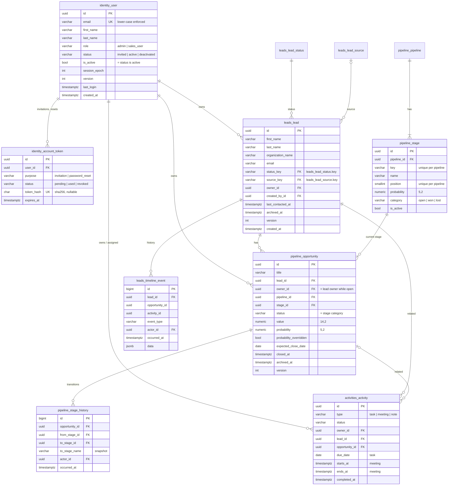

# Database design

PostgreSQL 16 with the `pgvector` extension is the single system of record
([ADR-0002](adr/0002-postgresql-data-integrity.md)). This document is the target schema for
Phases 0–8. Tables marked **(built)** exist (Phases 0–3); the rest are the design that
each phase implements, refines under test, and records here.

## Conventions

| Topic | Rule |
|---|---|
| Primary keys | Business entities: random `UUID` (safe in URLs, not enumerable). Internal append-only logs (audit, outbox, timeline, stage history): `BIGINT` identity, for index locality. Guarded by `tests/architecture/test_data_integrity.py`. |
| Money | `NUMERIC(14,2)`, Python `Decimal`, JSON **string** (`"1000000.00"`). Floating point is banned: an architecture test fails on any `FloatField`. |
| Probabilities | `NUMERIC(5,2)` in `[0, 100]`, enforced with a CHECK constraint. |
| Currency | One organisation currency (`CRM_CURRENCY`, default `INR`); no currency column in v1. Multi-currency is a later additive migration (a currency column defaulting to the org currency, plus grouped aggregates). |
| Time | `timestamptz`, stored in UTC. Date-only values (task due date, expected close date) are `date`. Business "today" is computed in `CRM_TIME_ZONE` ([ADR-0012](adr/0012-business-day-time-zone.md)). |
| Ownership | Every CRM record has `owner_id → identity_user` (the responsible user; UI label "Owner" or "Assigned to"). This single column is the authorization key for every read path, including Ask Arkray. |
| Deletion | Users: deactivated, never deleted. CRM records: soft-archived (`archived_at`). Foreign keys to users and CRM records are `ON DELETE PROTECT`. History is never lost to a delete. |
| Append-only | Audit, timeline and stage-history rows are insert-only: ORM guard (`AppendOnlyModel`) **and** a `BEFORE UPDATE OR DELETE` trigger (`core.db.append_only_trigger`). A test fails if an append-only model lacks its trigger. |
| Concurrency | Editable CRM records carry `version INT`; PATCH requires the current version, and a mismatch returns 409. State transitions (stage moves, reassignment) lock the row with `SELECT … FOR UPDATE`. |
| Integrity | Business invariants that can be expressed as CHECK/UNIQUE/FK constraints are expressed there. The service layer validates first for good error messages; the database is the final arbiter. |
| Indexes | Added for documented query patterns (below), mostly partial (`WHERE archived_at IS NULL`) and led by `owner_id`, because every CRM query is owner-scoped. No speculative indexes. Verified with `EXPLAIN` in each phase. |
| Naming | Explicit `db_table` names (`identity_user`, `audit_event`, …); constraint names are `<table>_<rule>`. |

## Entity-relationship diagram



Not drawn: `audit_event`, `core_outbox_event`, `core_idempotency_record` and `identity_auth_throttle_event` (no foreign keys by design),
`ai_knowledge_chunk` (Phase 8), and Django's `django_session` and `auth_*` tables.

## Tables

### `identity_user` (built; lifecycle added in Phase 1)

| Column | Type | Notes |
|---|---|---|
| `id` | uuid PK | |
| `email` | varchar(254) UNIQUE | CHECK `email = lower(email)`: case-insensitive uniqueness that holds even for writes bypassing the ORM; ASCII-only at the API ([canonicalisation](authorization.md#email-canonicalisation)) |
| `first_name` | varchar(100) | CHECK non-empty |
| `last_name` | varchar(100) | may be empty (mononymous names); `full_name` is computed |
| `role` | varchar(32) | CHECK `IN ('admin','sales_user')` (UI labels: Admin, User); mapped to capabilities in code ([authorization.md](authorization.md)) |
| `status` | varchar(16) | CHECK `IN ('invited','active','deactivated')` |
| `is_active` | bool | kept for Django's auth backend; CHECK `is_active = (status = 'active')` |
| `activated_at` | timestamptz NULL | CHECK: NULL when invited, set when active |
| `deactivated_at` | timestamptz NULL | CHECK: set exactly when deactivated |
| `password` | varchar(128) | Argon2id hash; CHECK an active user's password is usable (no `!` prefix) |
| `session_epoch` | int | part of the session auth hash; incremented to end every session (deactivation, email change, reset) |
| `version` | int | optimistic concurrency for admin edits (409 on a stale value) |
| `last_login`, `created_at`, `updated_at` | timestamptz | |

Indexes: `(created_at DESC, id DESC)` for the admin list order and cursor; GIN trigram indexes
on `UPPER(first_name)`, `UPPER(last_name)` and `UPPER(email)` for the admin search
(`icontains` compiles to `UPPER(col::text) LIKE …`; verified with `EXPLAIN`). The
`pg_trgm` extension is created by `identity.0002`.

### `identity_account_token` (Phase 1)

One-time secrets emailed to users ([ADR-0013](adr/0013-account-lifecycle-and-one-time-tokens.md)).

| Column | Notes |
|---|---|
| `id` uuid PK, `user_id` FK PROTECT, `created_by_id` FK NULL | `created_by` = the inviting admin (NULL for self-service resets) |
| `purpose` | CHECK `IN ('invitation','password_reset')` |
| `status` | CHECK `IN ('pending','used','revoked')` ("expired" = pending past `expires_at`) |
| `token_hash` char(64) NULL UNIQUE | SHA-256 of the secret; NULL until the email job mints it; CHECK `^[0-9a-f]{64}$` |
| `created_at`, `expires_at` | CHECK `expires_at > created_at` (invitations 72 h, resets 1 h) |
| `issued_at`, `sent_at`, `used_at`, `revoked_at` | CHECKs: `issued_at` iff `token_hash`; `sent_at` ⇒ issued; `used_at` iff used (and hashed); `revoked_at` iff revoked |

- **Partial UNIQUE `(user_id, purpose) WHERE status='pending'`**: at most one live link per
  user and purpose, so supersession is enforced by the database.
- Index `(user_id, purpose, created_at DESC)`: latest invitation, the resend cooldown and the
  reset-per-hour cap.
- The admin list joins the pending invitation through that unique partial index
  (`FilteredRelation`), so it takes one query per page.

### `identity_auth_throttle_event` (Phase 1)

Durable evidence for sign-in and reset throttling ([ADR-0014](adr/0014-durable-login-throttling.md)).
`id bigint`, `kind` (CHECK `login_failure|password_reset_request`), `occurred_at`,
`identifier_hash` (keyed HMAC of the submitted email, or empty; CHECK format),
`device_id` (trusted-browser id, or empty), `ip_address inet NULL` (the *source key*:
the IPv4 address, or an IPv6 address reduced to its /64; NULL = unknown source, one shared
bucket). There are no email addresses and no foreign keys.

| Index | Query pattern |
|---|---|
| `(identifier_hash, device_id, occurred_at DESC) WHERE kind='login_failure'` | the per-account-and-browser failure budget (LIMIT ≤ 10) |
| `(kind, ip_address, occurred_at DESC)` | the per-source limits for sign-in (LIMIT 50) and reset requests (LIMIT 20) |

Rows older than 24 h are purged hourly. Refused attempts are not recorded, so growth is
bounded by attacker sources × limits.

### `audit_event` (built, append-only)

`id bigint`, `occurred_at`, `actor_type (user|system)`, `actor_id uuid NULL`, `action`,
`target_type`, `target_id`, `subject_user_id uuid NULL` (whose workspace was involved),
`request_id`, `ip_address inet`, `metadata jsonb` (sanitised; secrets redacted; ≤ 4 KB).

- CHECKs: valid actor type; a user actor must have an id.
- Indexes: `(occurred_at DESC)`, `(actor_id, occurred_at DESC)`,
  `(subject_user_id, occurred_at DESC)`, `(target_type, target_id)`,
  `(action, occurred_at DESC)`.
- No foreign keys: audit history outlives and is independent of what it describes.
- Retention: keep indefinitely in v1. If volume ever requires it, partition by month and
  drop partitions under a privileged role ([security.md](security.md#database-privileges)).

### `core_outbox_event` (built)

Background work written in the business transaction ([reliability.md](reliability.md)).
`topic`, `queue`, `payload jsonb` (identifiers only, ≤ 16 KB), `dedupe_key`, `status
(pending|in_flight|done|dead)`, `attempts`, `max_attempts`, `available_at`, `locked_until`,
`claim_token uuid`, `last_error`, `correlation_id`, `created_at`, `finished_at`.

- `claim_token` identifies the current claim; every state transition must match it, so stale
  or duplicate broker messages are no-ops.
- Coalescing is best effort, **not** a unique constraint (a constraint would block retries and
  lease recovery). The partial index
  `(topic, dedupe_key) WHERE status='pending' AND attempts=0 AND dedupe_key<>''` finds merge
  candidates.
- CHECKs: valid status; in-flight rows have a lease and a claim token; `finished_at` is set
  exactly for done/dead.
- Partial indexes: `(queue, available_at) WHERE pending` (relay claim),
  `(queue, locked_until) WHERE in_flight` (in-flight cap, lease recovery).
- Housekeeping (Phase 10): purge `done` rows older than 7 days; `dead` rows are kept until
  an operator resolves them.

### `core_idempotency_record` (built, Phase 2)

Replays of create requests that carry an `Idempotency-Key`
([api-conventions.md](api-conventions.md#idempotency)): `id bigint`, `actor_id uuid`,
`operation`, `key uuid`, `request_hash` (SHA-256 of the validated request; CHECK hex
format), `resource_id uuid`, `created_at`. UNIQUE `(actor_id, operation, key)`, which is
also the index for the lazy per-actor purge of records older than 24 hours. No request
bodies, no responses, no foreign keys.

### `leads_lead_status`, `leads_lead_source` (built, Phase 2)

Configuration rows seeded by `leads.0002` and referenced from leads by their immutable
`key` ([ADR-0015](adr/0015-leads-domain-model.md), [leads.md](leads.md#statuses-sources-and-ratings)).

- Status: `id` uuid, `key` UNIQUE (CHECK `^[a-z][a-z0-9_]{0,31}$`), `name` UNIQUE
  (CHECK non-empty), `category` CHECK `IN ('open','qualified','unqualified','converted')`,
  `position`, `is_active`, `is_default` (partial UNIQUE: at most one default; CHECK the
  default is active). Seeded: New (default), Contacted (open), Qualified, Unqualified,
  Converted. **Business logic keys off `category`, never off names.**
- Source: `id`, `key` UNIQUE (same format CHECK), `name` UNIQUE, `position`, `is_active`.
  Seeded: Website, Referral, Campaign, Cold Call, Email, Event, Partner, Other.
- In-use rows can't be deleted (FK `PROTECT`); they are retired with `is_active = false`.

### `leads_lead` (built, Phase 2)

| Column | Notes |
|---|---|
| `id` uuid PK | |
| `first_name`, `last_name` varchar(100), `organization_name` varchar(200) | CHECK `leads_lead_name_present`: not all three empty |
| `job_title` varchar(100), `email` varchar(254) | email stored as typed (trimmed), not unique |
| `phone`, `mobile`, `alternate_phone` varchar(40) | stored as typed ([leads.md](leads.md#phone-numbers)); widened from 32 by `leads.0003` (review) |
| `phone_keys` varchar(40)[] | canonical matching keys of the three numbers, maintained by `Lead.save()` |
| `address_line_1`, `address_line_2` varchar(200), `city`, `state` varchar(100), `postal_code` varchar(20) | |
| `country` varchar(2) | `''` or CHECK `^[A-Z]{2}$` (ISO 3166-1 alpha-2, validated against the list by the service) |
| `status_key` FK → `leads_lead_status.key` NOT NULL, `source_key` FK → `leads_lead_source.key` NULL | PROTECT |
| `rating` varchar(8) NULL | CHECK NULL or `IN ('hot','warm','cold')` |
| `owner_id` FK → `identity_user` NOT NULL | the authorization key of every read path; PROTECT |
| `created_by_id` FK → `identity_user` NOT NULL | provenance; PROTECT |
| `last_contacted_at` timestamptz NULL | |
| `description` text | ≤ 5,000 characters (service) |
| `archived_at` timestamptz NULL | archive state |
| `version` int | CHECK `>= 1` |
| `created_at`, `updated_at` timestamptz | no ordering CHECK: both come from app-server clocks, and milliseconds of skew must not fail an edit (a CHECK did, found in review; dropped by `leads.0003`) |
| `display_name` varchar(201) **GENERATED ALWAYS … STORED** | `COALESCE(NULLIF(TRIM(first ' ' last), ''), organization_name)`; sort key and cursor for "name" |
| `last_contacted_sort` timestamptz **GENERATED ALWAYS … STORED** | `COALESCE(last_contacted_at, '1900-01-01')`: a NOT NULL sort key for the last-contact sorts, so cursors bound the index scan |
| `search_text` text **GENERATED ALWAYS … STORED** | `UPPER(first ' ' last ' ' organisation ' ' email ' ' digits(phone) ' ' digits(mobile) ' ' digits(alternate))` using immutable `regexp_replace`; the single column the Leads search matches |

Deviations from the Phase 0 draft: `owner` and "assigned to" are one column; `notes` are
activities (Phase 4); `converted_at` isn't stored (conversion is defined with opportunities
in Phase 3); the timeline table moves to Phase 4 ([leads.md](leads.md#deviations-from-the-suggested-field-list)).

**Indexes and the queries they serve.** Every index was justified by `EXPLAIN ANALYZE` on
a 300,000-lead benchmark (60 owners, one with 20,000 leads) using the exact SQL the API
runs; timings are for one page (26 rows). Indexes are **not** partial on `archived_at`:
the archived view and every filter reuse them (archived rows are a small fraction and are
filtered during the scan). Default FK indexes on `owner_id`, `created_by_id`, `status_key`
and `source_key` are **disabled** (`db_index=False`): nothing queries them alone, owner
lookups use the composite indexes, and users/statuses/sources are never deleted.

| Index | Query pattern | Measured |
|---|---|---|
| `leads_owner_created_idx (owner_id, created_at DESC, id DESC)` | one workspace's list, newest/oldest (backward scan), and the access path for every per-owner filter, search and archived view | 0.1–0.3 ms, deep cursor 0.14 ms |
| `leads_owner_updated_idx (owner_id, updated_at DESC, id DESC)` | one workspace, "recently updated" | 0.19 ms (**310 ms without it**: the planner walked the org-wide index for an owner whose leads cluster in time) |
| `leads_owner_contacted_idx (owner_id, last_contacted_sort DESC, id DESC)` | one workspace, "recently contacted" and (backward) "longest since contact, never contacted first" | 0.1–0.9 ms (27–36 ms without it) |
| `leads_owner_name_idx (owner_id, display_name, id)` | one workspace sorted by name, including with selective filters or a search | 0.1–8 ms (**136–368 ms without it**: the planner walked the organisation-wide name index filtering by owner; found in review) |
| `leads_created_idx (created_at DESC, id DESC)` | organisation-wide list, newest/oldest; status, date-range and archived views | 0.15–0.5 ms |
| `leads_name_idx (display_name, id)` | organisation-wide (and per-owner) sort by name | 0.14 ms, deep cursor 1.2 ms |
| `leads_updated_idx (updated_at DESC, id DESC)` | organisation-wide "recently updated" | 0.18 ms |
| `leads_contacted_idx (last_contacted_sort DESC, id DESC)` | organisation-wide last-contact sorts (both directions), any depth | 0.1–0.2 ms, also 250,000 rows deep (**150–166 ms seq scan + sort without it**; 35–145 ms deep pages while the key was NULL-able) |
| `leads_search_trgm GIN (search_text gin_trgm_ops)` | `q` search (`search_text LIKE '%TERM%'` per term) | rare term 0.07 ms, exact email 12 ms, phone digits 0.7 ms |
| `leads_email_lower_idx (lower(email)) WHERE email <> ''` | duplicate check by email | combined with the next one: 0.35 ms |
| `leads_phone_keys_gin GIN (phone_keys)` | duplicate check by phone (`phone_keys && ARRAY[...]`) | (BitmapOr with the email index) |

The duplicate check is issued **without** `ORDER BY` so PostgreSQL combines the two
duplicate indexes (a `BitmapOr`, 0.35 ms) instead of walking a date index until it meets
a match (213 ms); the ≤ 50 candidates are ordered in Python.

Known slow shapes (organisation-wide, admin-only, bounded by the 10 s statement timeout;
risk R33): a filter combination with no or very few matches walks the whole created index
(127 ms at 300k), and search combined with the name sort on correlated data walks the name
index (197 ms). A 2-character term can't use trigrams (32 ms for a rare one at 300k).
`tests/performance/test_lead_query_plans.py` pins which index serves each list, search and
duplicate query shape.

### `leads_timeline_event` (Phase 4, append-only; moved from Phase 2 together with notes)

`lead_id FK`, `opportunity_id uuid NULL`, `activity_id uuid NULL`, `event_type`
(`lead.created`, `lead.reassigned`, `lead.status_changed`, `note.added`,
`task.created`, `task.completed`, `meeting.scheduled`, `meeting.completed`,
`opportunity.created`, `opportunity.stage_changed`, …), `actor_id FK NULL` (NULL = system),
`occurred_at`, `data jsonb` (safe summary: titles, from/to values).

- Written in the same transaction as the change it records (a subscriber to the lead
  domain events, [ADR-0017](adr/0017-in-transaction-domain-events.md)). Lead history from
  Phases 2–3 is in the audit log and can be backfilled from it.
- `opportunity_id` and `activity_id` are plain UUIDs rather than FKs. This keeps the
  dependency direction `pipeline/activities → leads` acyclic; the referenced rows are never
  hard-deleted.
- Indexes: `(lead_id, occurred_at DESC, id DESC)`;
  `(opportunity_id, occurred_at DESC) WHERE opportunity_id IS NOT NULL`.
- Visible to whoever can see the lead ([authorization.md](authorization.md#related-records-and-timelines)).

### `pipeline_pipeline`, `pipeline_stage` (built, Phase 3)

Configuration rows seeded by `pipeline.0003` ([pipeline.md](pipeline.md#stages)).

- Pipeline: `id` uuid, `key` UNIQUE (CHECK `^[a-z][a-z0-9_]{0,31}$`), `name` UNIQUE (CHECK
  non-empty), `is_default` (partial UNIQUE: at most one; CHECK the default is active),
  `is_active`, timestamps. Seeded: Sales Pipeline (`sales`, default).
- Stage: `id` uuid, `pipeline_id` FK PROTECT, `key` (UNIQUE per pipeline, same format
  CHECK), `name` (CHECK non-empty; UNIQUE per pipeline among **active** stages,
  case-insensitively: `lower(name)` partial unique index), `position` smallint (UNIQUE per
  pipeline, **DEFERRABLE INITIALLY DEFERRED** so a reorder can swap positions in one
  transaction), `probability NUMERIC(5,2)` (CHECK 0-100), `category` CHECK `IN
  ('open','won','lost')`, `is_active`, timestamps.
  - CHECKs: won ⇒ probability 100; lost ⇒ probability 0.
  - UNIQUE `(id, pipeline_id, category)`: the target of the opportunities' composite key,
    which also stops a stage's category or pipeline from changing while it is in use.
  - Seeded: New (10 %), Qualified (25 %), Proposal (50 %), Negotiation (75 %), Won (100 %,
    won), Lost (0 %, lost). Retired rather than deleted (FK `PROTECT`).

### `pipeline_opportunity` (built, Phase 3)

| Column | Notes |
|---|---|
| `id` uuid PK | |
| `title` varchar(200) | CHECK non-empty |
| `lead_id` FK → `leads_lead` | PROTECT; fixed for the opportunity's lifetime |
| `owner_id` FK → `identity_user` | PROTECT; the authorization key; while open, always the lead's owner (below) |
| `pipeline_id`, `stage_id` FK | PROTECT; bound to each other and to `status` by the composite key below |
| `status` varchar(8) | `open`/`won`/`lost`, CHECK; **equal to the stage's category** (composite FK) |
| `value` NUMERIC(14,2) | CHECK `>= 0` (precision caps it at 999,999,999,999.99) |
| `probability` NUMERIC(5,2) | CHECK 0-100; won ⇒ 100, lost ⇒ 0 (CHECKs) |
| `probability_overridden` bool | CHECK only while open |
| `expected_close_date` date NULL | CHECK 2000-01-01 … 2099-12-31 |
| `description` text, `lost_reason` varchar(500) | CHECK lost_reason empty unless lost |
| `closed_at` timestamptz NULL | CHECK set exactly while won or lost |
| `created_by_id` FK | PROTECT; provenance |
| `archived_at`, `version` (CHECK ≥ 1), `created_at`, `updated_at` | |
| `open_owner_id` uuid **GENERATED** | `CASE WHEN status='open' THEN owner_id END` |
| `expected_close_sort` date **GENERATED** | `COALESCE(expected_close_date, '9999-12-31')`, NOT NULL sort key |
| `closed_sort` timestamptz **GENERATED** | `COALESCE(closed_at, '1900-01-01')`, NOT NULL sort key |

Composite foreign keys (`pipeline.0002`, [ADR-0018](adr/0018-pipeline-integrity-by-composite-keys.md)):

- `pipeline_opportunity_stage_category_fk`: `(stage_id, pipeline_id, status) REFERENCES
  pipeline_stage (id, pipeline_id, category)`.
- `pipeline_opportunity_open_owner_fk`: `(lead_id, open_owner_id) REFERENCES leads_lead
  (id, owner_id) DEFERRABLE INITIALLY DEFERRED` (MATCH SIMPLE: closed opportunities, whose
  `open_owner_id` is NULL, are exempt). `leads_lead` has `UNIQUE (id, owner_id)` for it
  (`leads.0004`).

**Indexes and the queries they serve.** Justified by `EXPLAIN ANALYZE` of the exact SQL
the selectors run on a 300,000-opportunity benchmark (100,000 leads, 60 owners, the
heaviest with 20,100; [pipeline.md](pipeline.md#performance) has the full table).
Default FK indexes are disabled (`db_index=False`): nothing queries those columns alone.

| Index | Query pattern | Measured (heaviest owner / organisation) | Size at 300k |
|---|---|---|---|
| `pipeline_opp_owner_open_idx (owner_id, stage_id, expected_close_sort, created_at, id) WHERE status='open' AND archived_at IS NULL` | one owner's open board columns; one owner's open stage lists (the board's `next`); one owner's pipeline totals and "closing this month" | cards 0.4 ms, stage list 0.1 ms, totals 4.1 ms | 19 MB |
| `pipeline_opp_owner_closed_idx (owner_id, stage_id, closed_sort DESC, id DESC) WHERE status<>'open' AND archived_at IS NULL` | one owner's Won/Lost columns and their stage lists | 0.1 ms | 15 MB |
| `pipeline_opp_open_idx (stage_id, expected_close_sort, created_at, id) WHERE status='open' AND archived_at IS NULL` | organisation-wide open columns and stage lists | cards 2.4 ms (all six columns), stage list 0.17 ms | 17 MB |
| `pipeline_opp_closed_idx (stage_id, closed_sort DESC, id DESC) WHERE status<>'open' AND archived_at IS NULL` | organisation-wide Won/Lost columns and stage lists | 0.1 ms | 10 MB |
| `pipeline_opp_lead_idx (lead_id, created_at DESC, id DESC)` | a lead's opportunities (lead page); the reassignment subscriber's lock query; the conversion guard; the ownership FK's lookup when a lead's owner changes | 0.01-0.05 ms | 21 MB |
| `pipeline_opp_owner_created_idx (owner_id, created_at DESC, id DESC)` | one owner's default list (newest/oldest), archived view, per-stage aggregates (bitmap), other per-owner sorts (bitmap + sort) | 0.1-9 ms | 30 MB |
| `pipeline_opp_created_idx (created_at DESC, id DESC)` | organisation-wide default list and archived view | 0.14-0.2 ms | 12 MB |

The board's partial indexes cover one status each, so the board's per-stage query and a
stage-filtered list state the stage's category as the status (always equal, database-
enforced); without it PostgreSQL couldn't use them (27-30 ms per owner before the fix,
0.4 ms after). `tests/performance/test_pipeline_query_plans.py` pins which index serves
each shape.

Known slow shapes (admin-only, organisation-wide, bounded by page size and the 10 s
statement timeout; risk R40): lists sorted by value, expected close, recently updated or
closed walk the table (114-133 ms at 300k); organisation-wide per-stage aggregates and
totals are sequential scans (37-46 ms). Per-owner variants are 2-10 ms.

### `pipeline_stage_history` (built, Phase 3, append-only)

`id bigint`, `opportunity_id` FK PROTECT, `from_stage_id` FK NULL (NULL on creation),
`to_stage_id` FK, `from_stage_name`/`to_stage_name` and `from_status`/`to_status` (copies:
the history stays readable after renames and retirements), `value` and `probability` as
the opportunity entered the stage, `lost_reason`, `actor_id` FK, `occurred_at`.

- CHECKs: valid `to_status`; a creation row has no "from" at all, any other row a complete
  one; lost reason only on lost rows.
- Append-only: `AppendOnlyModel` plus the `pipeline_stage_history_append_only` trigger
  (UPDATE and DELETE refused even from raw SQL; tested).
- Written in the transaction that moves the stage, while holding the opportunity's lock.
- Index `pipeline_history_opp_idx (opportunity_id, occurred_at DESC, id DESC)`: the
  history page (keyset, newest first).

### `activities_activity` (Phase 4)

One table for every activity type ([ADR-0009](adr/0009-unified-activity-model.md)).

| Column | task | meeting | note |
|---|---|---|---|
| `type` | `task` | `meeting` | `note` |
| `title` | required | required | optional |
| `description` | optional | optional | required (the note body) |
| `status` | open, completed, cancelled | scheduled, completed, cancelled, no_show | logged |
| `priority` | low, medium, high (required) | NULL | NULL |
| `due_date` (date) | optional | NULL | NULL |
| `starts_at`, `ends_at` | NULL | required, `ends_at > starts_at` | NULL |
| `location`, `meeting_url` | — | optional (`https://` only) | — |
| `completed_at` | set iff completed | set iff completed | NULL |
| `lead_id`, `opportunity_id` | optional | optional | at least one required |

Common columns: `owner_id` (the assignee; the authorization key), `created_by_id`,
`archived_at`, `version`, timestamps. Every row of the matrix above is a CHECK constraint.
If `opportunity_id` is set, the service sets `lead_id` to the opportunity's lead.

Indexes:

| Index | Query pattern |
|---|---|
| `(owner_id, due_date) WHERE type='task' AND status='open' AND archived_at IS NULL` | open / due today / overdue tasks |
| `(owner_id, starts_at) WHERE type='meeting' AND archived_at IS NULL` | today's and upcoming meetings; meetings needing follow-up (`ends_at < now()` and still scheduled) |
| `(lead_id, created_at DESC)`, `(opportunity_id, created_at DESC)` | timelines, related lists |

Adding Call, Email or WhatsApp later: add the enum value, the type's status set and any
columns (for example `duration_seconds`, `direction`) with their CHECKs in one migration,
plus a type spec in code. No new tables and no API redesign.

### `ai_knowledge_chunk` (Phase 8)

`source_type`, `source_id uuid`, `lead_id uuid NULL`, **`owner_id uuid NOT NULL`**,
`chunk_index`, `content`, `content_hash char(64)`, `embedding vector(1024)`,
`embedding_model`, `source_updated_at`, `indexed_at`.
UNIQUE `(source_type, source_id, chunk_index)`; btree `(owner_id)`, `(lead_id)`; HNSW on
`embedding vector_cosine_ops`. The vector index **locates candidates only**: every hit is
re-verified against the live source table through the caller's scope before any text
reaches the model ([rag-architecture.md](rag-architecture.md)).

## Aggregate queries (Phase 5)

Dashboard figures are single aggregate statements, never Python loops over rows. For a
scope (for example `owner_id = :u`) and `:today_start`/`:today_end` computed in
`CRM_TIME_ZONE`:

```sql
-- Leads
SELECT count(*)                                         AS total_leads,
       count(*) FILTER (WHERE created_at >= :today_start
                          AND created_at <  :today_end) AS new_leads_today
FROM leads_lead WHERE owner_id = :u AND archived_at IS NULL;

-- Pipeline (built in Phase 3: pipeline.metrics / selectors.pipeline_totals; the dashboard
-- calls that, it never re-derives the formula). Exact NUMERIC: a product, not a division
-- (PostgreSQL would choose the division's scale and round there), rounded once, half away
-- from zero.
SELECT coalesce(sum(value), 0.00)                               AS pipeline_value,
       coalesce(round(sum(value * probability * 0.01), 2), 0.00) AS weighted_pipeline,
       count(id)                                                AS open_count
FROM pipeline_opportunity
WHERE owner_id IN (:u) AND archived_at IS NULL AND status = 'open';

-- Tasks
SELECT count(*)                                     AS open_tasks,
       count(*) FILTER (WHERE due_date = :today)    AS due_today,
       count(*) FILTER (WHERE due_date < :today)    AS overdue
FROM activities_activity
WHERE owner_id = :u AND type = 'task' AND status = 'open' AND archived_at IS NULL;
```

Worked example from the requirements: one open opportunity of ₹1,000,000 at 50% gives
`pipeline_value = 1000000.00` and `weighted_pipeline = 500000.00`.

Admin views run the same statements with `GROUP BY owner_id` for one page of users
(`owner_id = ANY(:page_user_ids)`), so the users table costs a constant number of queries
per page regardless of how many users or records exist.

## Migrations

- One migration history per module; `makemigrations` output is reviewed and committed.
  Hand-written `RunSQL` is used only for what Django cannot express (triggers, extensions).
- Production changes follow **expand → migrate → contract**: add nullable or defaulted
  columns first, deploy code that writes both shapes, backfill in batches, then tighten
  constraints in a later release. No long table locks during business hours.
- Extensions (`vector`, `pg_trgm`) are created by the migration of the module that needs
  them. Both are "trusted" extensions installable by the database owner role.
