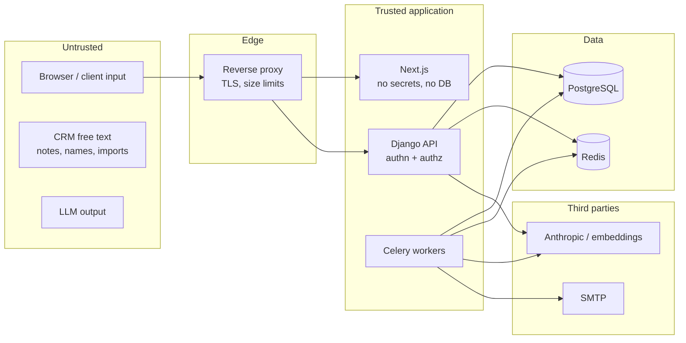

# Security

Threat model, trust boundaries and the controls for each risk. Authorization details are in
[authorization.md](authorization.md), and Ask Arkray-specific controls in
[rag-architecture.md](rag-architecture.md#prompt-injection).

## Assets

1. CRM data: leads' personal data (names, phones, emails), deal values, notes (free text
   that may hold anything a salesperson writes).
2. User accounts and sessions, especially administrators'.
3. Audit trail integrity.
4. Secrets: Django secret key, database, SMTP and AI provider credentials.

## Trust boundaries

- **Everything from the browser is untrusted**, including IDs in URLs, filters, sort keys
  and JSON bodies.
- **CRM free text is untrusted** even when authored by a legitimate user. It is rendered
  escaped in the UI and treated as data (never instructions) by Ask Arkray.
- **LLM output is untrusted.** Tool arguments are validated against strict schemas; the
  narrative is sanitised and grounding-checked before display.
- Only Django and the workers hold database and provider credentials. Next.js holds none.

## Controls by threat

| Threat | Controls | Status |
|---|---|---|
| **SQL injection** | ORM or parameterised SQL only; ruff bandit rules (`S608`); no raw filter or order-by passthrough | built (baseline) |
| **XSS** | React escapes by default; no `dangerouslySetInnerHTML` except the sanitised Ask Arkray markdown renderer (no raw HTML, no images); API is JSON-only (`X-Content-Type-Options: nosniff`); a nonce-based CSP is added in Phase 9 | baseline built; CSP P9 |
| **CSRF** | SameSite=Lax session cookie; Django CSRF double-submit (`X-CSRFToken`) and Origin check on **every** unsafe API request, signed in or not (`core.api.ApiView`), so login CSRF is refused too; a matrix test covers every unsafe route | built (P1) |
| **IDOR / broken object-level authorization** | workspace-nested routes; every lookup through `AccessScope.apply()`, in the services as well as the views; 404 outside scope, with bodies identical to a missing record; cursors carry sort values only; the duplicate check looks only inside the caller's workspace; authorization matrix and a cross-user suite (User A vs User B both ways, every channel) | built for leads (P2) and pipeline (P3: opportunities, boards, **totals and per-stage values**, history, conversion); suites P4–P8 |
| **Broken function-level authorization** | DRF global `DenyAll`; per-endpoint capabilities; route-inventory test fails on any unlisted `/api/` route; delegated writes need `crm.manage_any` and ownership changes `crm.assign_any`, checked in the services for every caller | built |
| **Mass assignment** | strict input serializers reject undeclared keys with a 400 (`is_superuser`, `capabilities`, `status`, `password`, `owner`, `created_by`, `archived_at`, ...); the services check fields against their own allowlist too; ownership, status, archive state, provenance, timestamps and version are never directly writable; transitions go through action endpoints | built (P1: users; P2: leads; P3: opportunities: owner, status, stage, closed_at, probability flags, version and provenance are never writable; the owner always follows the lead) |
| **Open redirects** | no user-controlled redirect targets in the API; the frontend's post-login `next` accepts same-origin absolute paths only, checked on the raw input **and** after URL normalisation (the review found `/.//evil.com` resolving to `//evil.com`); no `//`, backslashes, control characters or auth pages (tested) | built (P1) |
| **Brute-force login / password spraying** | PostgreSQL-backed throttling keyed by the submitted email (HMAC) and browser, plus per IP; bounded exponential lockout (max 15 min); trusted-browser budgets so attackers can't lock owners out; refused before the password check; advisory lock against parallel bursts; audited once per threshold ([ADR-0014](adr/0014-durable-login-throttling.md)) | built (P1) |
| **Session fixation / hijacking** | a new session key on every sign-in (also re-sign-in); HttpOnly + Secure + SameSite; 12 h absolute and 2 h idle limits; `session_epoch` in the session hash ends every session on deactivation, email change and password reset, and old sessions stay dead after reactivation; password change keeps only the current session | built (P1) |
| **Account enumeration** | identical status, body and cookies for every failed sign-in, with the hasher run in every case (decoy hash); throttling keyed by the submitted email, whether or not it exists; password-reset requests do constant work (the job decides eligibility); workspace 404s identical for missing and forbidden users; admin-only 403s never depend on whether the target exists | built (P1) |
| **Privilege escalation via admin impersonation** | no impersonation feature exists; admin workspace access is scoped reads/writes as the admin, audited | built |
| **Privilege escalation via user management** | capability checks (`users.manage`) in the view **and** under the admin lock in every service; no self role change or self deactivation; at least one active administrator always remains; demotion and deactivation take effect on the next request | built (P1) |
| **Data left on a shared browser** | a sign-in, sign-out or session end reloads the page after rendering nothing; pages restored from the back/forward cache reload; app pages are `Cache-Control: no-store`; other tabs are told (BroadcastChannel) and reload; the viewer is re-checked when a tab regains focus | built (P1) |
| **Account takeover via emailed links** | 256-bit random, single-use, expiring, superseded on reissue, purpose-bound; only SHA-256 digests stored; the secret is minted by the email job so it never touches a web request, the outbox or logs; email changes revoke pending links; link pages send `Referrer-Policy: no-referrer` and `Cache-Control: no-store` ([ADR-0013](adr/0013-account-lifecycle-and-one-time-tokens.md)) | built (P1) |
| **Audit tampering** | append-only at ORM and DB-trigger level; production app role has no UPDATE/DELETE/TRUNCATE on audit tables | trigger built; roles P11 |
| **Unsafe file uploads (CSV import)** | size cap (10 MB), extension and content sniffing, parsed in a worker with row limits, stored outside the web root, never executed | designed; import deferred (not in the Phase 2 brief) |
| **CSV/formula injection on export** | cells starting with `=`, `+`, `-`, `@`, tab or CR are prefixed with `'`; exports are streamed and bounded | designed; export deferred |
| **Spoofed or invisible text in CRM records** | names and other text are NFC-normalised; control characters and bidi embedding/override/isolate characters are refused (zero-width joiners kept for Indic scripts) | built (P2) |
| **Duplicate records from retries** | lead create, opportunity create and lead conversion accept an `Idempotency-Key` (per user and operation, 24 h, request digest checked); conversion also locks the lead and refuses a second conversion, so even without a key a double click converts once; the UI reuses a key only for an identical retry and blocks double submits | built (P2, P3) |
| **Aggregate leakage** (totals revealing records the caller can't see) | every total, count and per-stage value is computed from `scope.apply()` first, in one selector (`pipeline.selectors.pipeline_totals` / `board`); filters only narrow; organisation-wide totals need `crm.view_all`; tested: A's totals are identical whether or not B has opportunities, and an admin's view of a user's workspace sums that user only | built (P3) |
| **Financial manipulation / float errors** | NUMERIC end to end; amounts only as plain decimal strings or integers (no floats, exponents, NaN, non-ASCII digits); weighted values computed by PostgreSQL, rounded once; CHECKs for won = 100 %, lost = 0 %, value ≥ 0 | built (P3) |
| **Information in URLs** | cursors carry sort values only, and personal or business-sensitive ones (names, deal amounts) are private keys re-read by id, never written into the link | built (P2 names, P3 amounts) |
| **Answers revealing hidden records** | the "Converted needs an opportunity" check counts only opportunities of the lead's current owner, so a deal someone else closed before a reassignment can't be detected through a 200-vs-422 difference (Phase 3 review) | built (P3) |
| **Ownership drift** (an open opportunity owned by someone other than its lead's owner) | database-enforced by a deferred composite foreign key; reassignment moves open opportunities in the same transaction; one documented lock order ([ADR-0018](adr/0018-pipeline-integrity-by-composite-keys.md)) | built (P3) |
| **Secret leakage** | env vars only (`.env` git-ignored, `.env.example` placeholders); production refuses dev or short secret keys (tested); secrets never logged; audit metadata redacts secret-looking keys | built |
| **Log injection / id spoofing** | ASCII-escaped JSON logs (control characters and Unicode line separators escaped), and the console format escapes too; correlation ids are minted server-side; a client `X-Request-ID` (validated against `^[A-Za-z0-9._-]{8,64}$`) is adopted only from a trusted proxy, otherwise logged separately and never written to audit; no query strings or bodies logged | built |
| **Request-body decompression bomb** (Phase 2 review, P1, present since Phase 1) | the only parser decodes JSON as UTF-8 and refuses any other `charset` with 415 before reading (Django accepted any Python codec, including `zlib`/`bz2`, so 100 KB inflated to 100 MB, and a body under the 2.5 MB limit to gigabytes, on every endpoint, signed in or not); deep nesting is a 400 | built (P2) |
| **Excessive requests / DoS** | DRF throttles (anon 60/min, user 600/min, scoped stricter limits for login, reset, ask, search, import); bounded page sizes; statement timeouts; gunicorn timeouts; proxy body-size limits | baseline built |
| **Prompt injection / RAG authorization bypass** | scope-bound, read-only tools; no scope parameters exposed; vector hits re-verified; no exfiltration channel in rendered output | design; P8 |
| **Stack-trace disclosure** | `DEBUG=False` in production (enforced); JSON 500 handler with a generic message and request id | built |
| **Clickjacking** | `X-Frame-Options: DENY` on API and web; CSP `frame-ancestors 'none'` (P9) | built |
| **Dependency vulnerabilities** | lockfiles (`uv.lock`, `pnpm-lock.yaml`); `pip-audit` and `pnpm audit` in CI; pinned container image tags; Dependabot (P11) | built (pip-audit) |

## Notes and other activity text (Phase 4)

- Note bodies, task descriptions, meeting agendas, locations and links are never written to
  logs, audit metadata (field **names** only), timeline snapshots, exception messages,
  domain events or analytics; tests assert a secret note never appears in audit or
  timeline rows.
- Lists and timelines return a 240-character preview; the whole text only on the record's own
  page, for someone who may see it.
- Text is normalised and refused if it hides characters (bidi overrides, zero-width
  spaces, the tag block) like every other free text (`core.text`).
- Meeting links: `https://` only (CHECK constraint and validation), no user name or password
  in the URL (they would leak to everyone who can see the meeting), rendered with
  `target="_blank" rel="noopener noreferrer"`.
- A note's text can be edited only by its author, so nobody can put words in someone else's
  name; edits are audited.
- No embeddings are generated (Ask Arkray is Phase 8); the activity domain events are the
  extension point, with no subscribers yet.

## Security headers

| Header | API (Django) | Web (Next.js) |
|---|---|---|
| `Strict-Transport-Security` | 1 year (production) | set at the proxy |
| `X-Content-Type-Options: nosniff` | ✓ | ✓ |
| `X-Frame-Options: DENY` | ✓ | ✓ |
| `Referrer-Policy: same-origin` | ✓ | ✓ |
| `Cross-Origin-Opener-Policy: same-origin` | ✓ | ✓ |
| `Permissions-Policy` | — | camera, microphone, geolocation, payment disabled |
| `Content-Security-Policy` | Phase 9 (`default-src 'none'` for JSON) | Phase 9 (nonce-based) |
| `X-Powered-By` | not sent | disabled |

## Secrets management

- Local: `.env` from `scripts/init-env.sh` (generates a strong key). Never committed.
- Production: injected by the platform's secret manager as environment variables. Rotation
  is a restart; rotating `DJANGO_SECRET_KEY` invalidates sessions and outstanding
  password-reset or invitation links (expected).
- `config/settings/production.py` refuses to start with a missing, short or `dev-`/`test-`
  secret key, or without `DJANGO_ALLOWED_HOSTS` (covered by tests).

## Database privileges

Two roles in production:

| Role | Used by | Privileges |
|---|---|---|
| `arkray_owner` | migration job only | owns schema; DDL |
| `arkray_app` | web, workers | `SELECT, INSERT, UPDATE, DELETE` on ordinary tables; **`SELECT, INSERT` only** on `audit_event`, `leads_timeline_event`, `pipeline_stage_history`; no DDL; no TRUNCATE |

The append-only trigger stops UPDATE and DELETE even for a compromised app role;
privileges stop TRUNCATE. The development container uses a single superuser for
convenience.

## Personal data

- Leads' personal data is kept only as long as needed; archived leads remain for history
  and a purge process is defined with the business (Phase 11).
- Logs contain identifiers, not personal data (no emails, phone numbers, names or search
  terms). Lead audit events record field **names** and status keys, never values; a lead's
  `str()` is its id (tested with a lead full of contact data through create, search,
  duplicate check and a failed edit). Opportunity audit events and domain events carry
  ids, stage keys and statuses only: no titles, amounts, descriptions or lost reasons;
  an opportunity's `str()` is its id. A closed opportunity whose lead has moved to
  another workspace shows the lead as `restricted` (its name is not sent).
- The Leads UI keeps searches and filters in memory only, never in URLs, browser history
  or storage.
- Data sent to AI providers is minimised ([rag-architecture.md](rag-architecture.md#privacy-and-data-minimisation));
  AI can be disabled entirely.

## Security testing

Automated: authorization matrix and cross-user suites, CSRF enforcement on every unsafe
route, throttling and enumeration tests, real-concurrency race tests, secret-hygiene scans
of logs, audit, outbox and responses, dependency-outage tests, production-settings tests,
ruff bandit rules, `pip-audit`, `pnpm audit`. Phase 9 adds a manual threat-model review, header and CSP verification, and
a focused penetration test of authorization, admin workspace and Ask Arkray.
