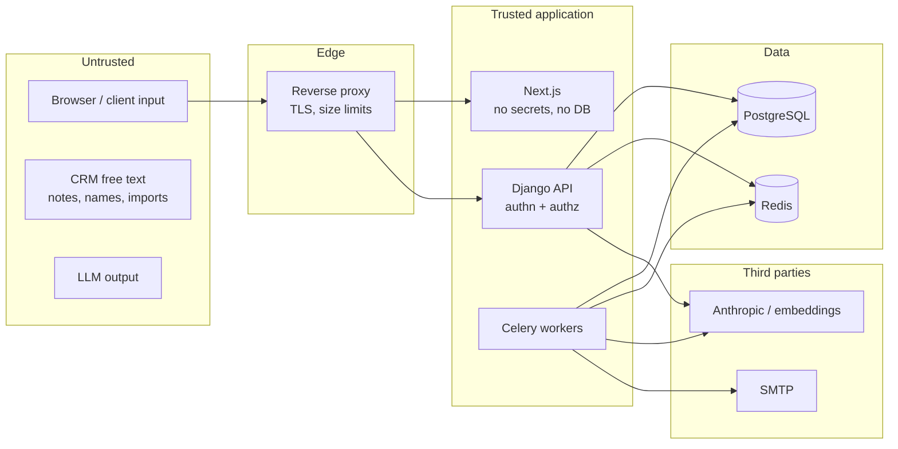

# Security

Threat model, trust boundaries and the controls for each risk. Authorization details are in
[authorization.md](authorization.md), and Ask Arkray-specific controls in
[rag-architecture.md](rag-architecture.md#prompt-injection).

## Assets

1. CRM data: leads' personal data (names, phones, emails), deal values, notes (free text
   that may hold anything a salesperson writes).
2. User accounts and sessions, especially administrators'.
3. Audit trail integrity.
4. Secrets: Django secret key, database, SMTP and AI provider credentials.

## Trust boundaries



- **Everything from the browser is untrusted**, including IDs in URLs, filters, sort keys
  and JSON bodies.
- **CRM free text is untrusted** even when authored by a legitimate user. It is rendered
  escaped in the UI and treated as data (never instructions) by Ask Arkray.
- **LLM output is untrusted.** Tool arguments are validated against strict schemas; the
  narrative is sanitised and grounding-checked before display.
- Only Django and the workers hold database and provider credentials. Next.js holds none.

## Controls by threat

| Threat | Controls | Status |
|---|---|---|
| **SQL injection** | ORM or parameterised SQL only; ruff bandit rules (`S608`); no raw filter or order-by passthrough. Global search's window (`core.ranking`, the one place that writes SQL text) wraps Django-compiled querysets in CTEs adding only constants and identifiers quoted from model metadata; every searched word and scope id is a bound parameter (`test_window.py::test_the_sql_holds_no_searched_text`); quotes, `%`, `_`, backslashes, SQL and regex syntax are literal characters (`test_input.py`) | built (baseline; P7 search) |
| **XSS** | React escapes by default; no `dangerouslySetInnerHTML` anywhere (Ask Arkray answers are typed blocks rendered as text nodes; script, image and attribute payloads tested); API is JSON-only (`X-Content-Type-Options: nosniff`); search results are plain text and their highlighting is built from text slices and `<mark>` elements, never HTML strings (script, attribute, entity and bidi payloads tested); a nonce-based Content-Security-Policy on every page (`frontend/src/proxy.ts`: scripts and styles only from this origin or carrying the page's fresh nonce, no inline code, no `eval` in production, `object-src 'none'`, `base-uri`/`form-action 'self'`; unit-tested and checked in the browser for violations), and the API's JSON carries `default-src 'none'`; `mailto:` links encode header delimiters and lead emails containing them are refused (a lead email could add a Bcc to a colleague's draft) | built (P7 search; CSP and mailto P9) |
| **CSRF** | SameSite=Lax session cookie; over HTTPS the session and CSRF cookies are `__Host-` cookies (Secure, host-only, Path=/: a sibling subdomain can't set or shadow them; P9); Django CSRF double-submit (`X-CSRFToken`) and Origin check on **every** unsafe API request, signed in or not (`core.api.ApiView`), so login CSRF is refused too; a matrix test covers every unsafe route | built (P1) |
| **IDOR / broken object-level authorization** | workspace-nested routes; every lookup through `AccessScope.apply()`, in the services as well as the views; 404 outside scope, with bodies identical to a missing record; cursors are sealed (encrypted and authenticated), bound to their list, user, workspace and filters, and expire with the longest session (P9: replays across users, workspaces, records, lists and filters are 400s, tested and mutation-checked); the duplicate check looks only inside the caller's workspace; authorization matrix and a cross-user suite (User A vs User B both ways, every channel) | built for leads (P2), pipeline (P3: opportunities, boards, **totals and per-stage values**, history, conversion), activities and timelines (P4), the dashboard (P5: every figure and list), selected-user workspaces (P6) and global search (P7: the scope applied before any word is matched; marked records from every workspace; another workspace's exact secret indistinguishable from nothing); suite P8 |
| **Broken function-level authorization** | DRF global `DenyAll`; per-endpoint capabilities; route-inventory test fails on any unlisted `/api/` route; delegated writes need `crm.manage_any` and ownership changes `crm.assign_any`, checked in the services for every caller and, since Phase 9, before a write's body is even read; the matrix also runs every route as a view-only role (reads pass, every write elsewhere refused) and as a deactivated user's open session (401 everywhere) | built (view-only and deactivated principals P9) |
| **Mass assignment** | strict input serializers reject undeclared keys with a 400 (`is_superuser`, `capabilities`, `status`, `password`, `owner`, `created_by`, `archived_at`, ...); the services check fields against their own allowlist too; ownership, status, archive state, provenance, timestamps and version are never directly writable; transitions go through action endpoints | built (P1: users; P2: leads; P3: opportunities: owner, status, stage, closed_at, probability flags, version and provenance are never writable; the owner always follows the lead) |
| **Open redirects** | no user-controlled redirect targets in the API; the frontend's post-login `next` accepts same-origin absolute paths only, checked on the raw input **and** after URL normalisation (the review found `/.//evil.com` resolving to `//evil.com`); no `//`, backslashes, control characters or auth pages (tested) | built (P1) |
| **Brute-force login / password spraying** | PostgreSQL-backed throttling keyed by the submitted email (HMAC) and browser, plus per IP; bounded exponential lockout (max 15 min); trusted-browser budgets so attackers can't lock owners out, the trusted-browser cookie bound to the account's credentials so a reset or password change retires every browser trusted before it (P9); refused before the password check; advisory lock against parallel bursts; audited once per threshold ([ADR-0014](adr/0014-durable-login-throttling.md)) | built (P1) |
| **Session fixation / hijacking** | a new session key on every sign-in (also re-sign-in); HttpOnly + Secure + SameSite; 12 h absolute and 2 h idle limits; `session_epoch` in the session hash ends every session on deactivation, email change and password reset, and old sessions stay dead after reactivation; password change keeps only the current session; a password or own-email change re-checks under the user's row lock that its session is still current (Phase 9 review, P1: a change in flight could undo a password reset that had just ended the attacker's session) | built (P1; P9) |
| **Account enumeration** | identical status, body and cookies for every failed sign-in, with the hasher run in every case (decoy hash); throttling keyed by the submitted email, whether or not it exists; password-reset requests do constant work (the job decides eligibility); workspace 404s identical for missing and forbidden users; admin-only 403s never depend on whether the target exists | built (P1) |
| **Privilege escalation via admin impersonation** | no impersonation feature exists; admin workspace access is scoped reads/writes as the admin, audited; a test fails if any route looks like "login as" / "switch user", and the session stays the admin's through a whole workspace visit | built (P0); verified end to end (P6) |
| **Wrong-workspace data on screen** (one user's records under another user's banner) | the workspace comes from the URL, parsed once like the route param and failing closed (a malformed id is "not found", never the organisation or one's own records); the selected-user frame renders only when the URL's and the layout's user agree and canonicalises other spellings; every query key carries the workspace; views remount per workspace; placeholders never cross workspaces; failures show errors, not fallbacks ([admin-user-workspace.md](admin-user-workspace.md#cache-isolation)) | built (P6; the review found and fixed a percent-encoded id showing organisation data under a user's banner) |
| **Privilege escalation via user management** | capability checks (`users.manage`) in the view **and** under the admin lock in every service; no self role change or self deactivation; at least one active administrator always remains; role changes and deactivation take effect on the next request; another administrator's email, password and role can't be changed at all ([below](#administrator-account-protection)) | built (P1; R100) |
| **Data left on a shared browser** | a sign-in, sign-out or session end reloads the page after rendering nothing; pages restored from the back/forward cache reload; app pages are `Cache-Control: no-store`; other tabs are told (BroadcastChannel) and reload; the viewer is re-checked when a tab regains focus | built (P1) |
| **Account takeover via emailed links** | 256-bit random, single-use, expiring, superseded on reissue, purpose-bound; only SHA-256 digests stored; the secret is minted by the email job so it never touches a web request, the outbox or logs; email changes revoke pending links; link pages send `Referrer-Policy: no-referrer` and `Cache-Control: no-store` ([ADR-0013](adr/0013-account-lifecycle-and-one-time-tokens.md)) | built (P1) |
| **Audit tampering** | append-only at ORM and DB-trigger level (`audit_event`, `pipeline_stage_history`, `activities_timeline_entry`); the trigger binds the application's role only when that role neither owns the tables nor is a superuser (an owner can disable triggers or TRUNCATE: shown by the Phase 9 review), so production runs the app as a separate, non-owner role (P11); the actor is always the authenticated user (body fields, `X-Request-ID` and forwarding headers are never adopted); delegated viewing's audit window lives in PostgreSQL, so no cache entry can suppress an audit row (P9); metadata redacts secret keys and `key=value` secrets, bounds keys, depth and size, drops NUL, control and bidi characters (P9) | trigger built; window and metadata P9; roles P11 |
| **Unsafe file uploads (CSV import)** | size cap (10 MB), extension and content sniffing, parsed in a worker with row limits, stored outside the web root, never executed | designed; import deferred (not in the Phase 2 brief) |
| **CSV/formula injection on export** | cells starting with `=`, `+`, `-`, `@`, tab or CR are prefixed with `'`; exports are streamed and bounded | designed; export deferred |
| **Spoofed or invisible text in CRM records** | names and other text are NFC-normalised; control characters and bidi embedding/override/isolate characters are refused (zero-width joiners kept for Indic scripts); user names follow the same rules since Phase 9 (they took bidi overrides and line breaks into pickers and invitation emails) | built (P2; user names P9) |
| **Duplicate records from retries** | lead create, opportunity create and lead conversion accept an `Idempotency-Key` (per user and operation, 24 h, request digest checked); conversion also locks the lead and refuses a second conversion, so even without a key a double click converts once; the UI reuses a key only for an identical retry and blocks double submits | built (P2, P3) |
| **Aggregate leakage** (totals revealing records the caller can't see) | every total, count and per-stage value is computed from `scope.apply()` first, in the owning module's selector (`pipeline.selectors.pipeline_totals` / `board`, `activities.selectors.activity_summary`, `leads.selectors.lead_summary`); the dashboard only composes them with the request's scope; filters only narrow; organisation-wide figures need `crm.view_all`; tested: A's totals are identical whether or not B has records, A's whole dashboard response is byte-identical before and after B's records exist, and an admin's view of a user's workspace sums that user only | built (P3 pipeline, P4 activity counts, P5 dashboard) |
| **Financial manipulation / float errors** | NUMERIC end to end; amounts only as plain decimal strings or integers (no floats, exponents, NaN, non-ASCII digits); weighted values computed by PostgreSQL, rounded once; CHECKs for won = 100 %, lost = 0 %, value ≥ 0 | built (P3) |
| **Information in URLs** | cursors are sealed (P9: nothing in them is readable, not even sort values or row ids), and personal or business-sensitive sort values (names, deal amounts) are private keys re-read by id, never written into the link; append-only rows (timeline, stage history) show opaque ids, not their global sequence (R48); the re-read goes only through the caller's own scope, so a replayed or harvested cursor can't measure a hidden row's value by where one's own records land (a boundary outside the scope is a 400) | built (P2 names, P3 amounts; scoped re-read P6, review P1) |
| **Answers revealing hidden records** | the "Converted needs an opportunity" check counts only opportunities of the lead's current owner, so a deal someone else closed before a reassignment can't be detected through a 200-vs-422 difference (Phase 3 review); global search returns no counts, its results, sizes, "more" flags and order depend only on the scope's records, and nothing is matched by a related record's text (a kept deal can't be found by its moved lead's name); the residual timing difference is documented (R60) | built (P3; P7 search) |
| **Ownership drift** (an open opportunity owned by someone other than its lead's owner) | database-enforced by a deferred composite foreign key; reassignment moves open opportunities in the same transaction; one documented lock order ([ADR-0018](adr/0018-pipeline-integrity-by-composite-keys.md)) | built (P3) |
| **Secret leakage** | env vars only (`.env` git-ignored, `.env.example` placeholders); production refuses dev or short secret keys (tested); secrets never logged; HTTP-client and AI SDK loggers never log request bodies whatever `LOG_LEVEL` (and production refuses `ANTHROPIC_LOG`); the AI provider key is given to the ai worker only; audit metadata redacts secret-looking keys; the Phase 9 scan of the tree, the whole git history (unreachable objects and stashes included), the images and the logs found no secret | built (P9 scan) |
| **Log injection / id spoofing** | ASCII-escaped JSON logs (control characters and Unicode line separators escaped), and the console format escapes too; correlation ids are minted server-side; a client `X-Request-ID` (validated against `^[A-Za-z0-9._-]{8,64}$`) is adopted only from a trusted proxy, otherwise logged separately and never written to audit; no query strings or bodies logged | built |
| **Request-body decompression bomb** (Phase 2 review, P1, present since Phase 1) | the only parser decodes JSON as UTF-8 and refuses any other `charset` with 415 before reading (Django accepted any Python codec, including `zlib`/`bz2`, so 100 KB inflated to 100 MB, and a body under the 2.5 MB limit to gigabytes, on every endpoint, signed in or not); deep nesting is a 400 | built (P2) |
| **Excessive requests / DoS** | DRF throttles (anon 60/min, user 600/min, scoped stricter limits for login, reset, ask, search (120/min), import); bounded page sizes; statement timeouts; gunicorn timeouts; proxy body-size limits; global search is bounded per request whatever the words (input 2-100 characters, at most 5 words a trigram index can look up, 5 results per kind, a fixed recent pass, and an older pass gated on the index returning under 2 % of records; in one user's workspace only their activities are looked up; 24-120 ms per search at 1M leads / 2M activities, the worst shapes found 0.2-0.5 s organisation-wide (R59); [search.md](search.md#how-a-search-runs)) | baseline built (P7: search) |
| **Prompt injection / RAG authorization bypass** | scope-bound, read-only tools over the modules' selectors (no SQL, ORM, shell, file or HTTP tool); no owner/workspace parameter in any schema; the organisation tool absent outside organisation scope; every argument re-validated; vector candidates pre-filtered by owner in SQL, every hit re-read through the caller's scope and hash-checked, text sliced from the live record; user text returned as `untrusted_text`; answers rendered from typed blocks (no HTML, no model URLs), links only to records a tool returned; conversations bound to actor and workspace, history server-written | built (P8): the Rahul/Priya secret matrix over 5 viewpoints × 4 questions with and without an adversarial scripted model (no foreign text reaches the provider or the answer), direct and indirect injection, stale-vector reassignment, malicious tool arguments; each isolation layer mutation-checked |
| **Stack-trace disclosure** | `DEBUG=False` in production (enforced); JSON 500 handler with a generic message and request id | built |
| **Clickjacking** | `X-Frame-Options: DENY` on API and web; CSP `frame-ancestors 'none'` on both (P9) | built |
| **Dependency vulnerabilities** | lockfiles (`uv.lock`, `pnpm-lock.yaml`); `pip-audit` and `pnpm audit --prod` in CI (both clean in Phase 9; the dev-only `braces` advisory is R54); base images pinned by digest, OS packages upgraded at build; Dependabot (P11) | built |
| **Cache poisoning** (write access to Redis) | the cache never unpickles (django-redis JSON serializer: a write to Redis can't run code in the app); production refuses Redis and broker URLs without a password; nothing security-relevant lives only in the cache (the audit window is a database row, throttling evidence and bulkheads are in PostgreSQL) | built (P9) |
| **Persistence after a container compromise** | the application code is owned by root and read-only to the runtime user (only Next.js's cache is writable); the backend build context is an allowlist, so tests, caches and stray files never reach the image | built (P9) |

## Notes and other activity text (Phase 4)

- Note bodies, task descriptions, meeting agendas, locations and links are never written to
  logs, audit metadata (field **names** only), timeline snapshots, exception messages,
  domain events or analytics; tests assert a secret note never appears in audit or
  timeline rows.
- Lists and timelines return a 240-character preview; the whole text only on the record's own
  page, for someone who may see it.
- Text is normalised and refused if it hides characters (bidi overrides, zero-width
  spaces, the tag block) like every other free text (`core.text`).
- Meeting links: `https://` only (CHECK constraint and validation), no user name or password
  in the URL (they would leak to everyone who can see the meeting), rendered with
  `target="_blank" rel="noopener noreferrer"`.
- A note's text can be edited only by its author, so nobody can put words in someone else's
  name; edits are audited.
- Ask Arkray (Phase 8) embeds notes and task/meeting descriptions **inside the deployment**
  (a local model): their text is never sent anywhere to be indexed, and the index stores no
  text at all. Meeting links and locations are never embedded.

## Product enhancement phase: passwords, support sessions, files, configuration

| Threat | Control |
|---|---|
| An administrator learning a user's password | Never stored or returned in plaintext; admin-set passwords are temporary (forced change, 72 h expiry) and audited; administrators are invited, never given a password, and can't be promoted while one is pending; a sign-in with a temporary password is a security event; administrators see that a password changed, never what it is ([authorization.md](authorization.md#password-change-notification); [password secrecy](#password-secrecy)) |
| One administrator taking over another's account (R100) | Another administrator's email, password and role can't be changed, whatever the account's status ([below](#administrator-account-protection)) |
| "Log in as" turning into impersonation | Support sessions keep the administrator's identity, bind to their browser session, expire in 30 minutes, open only the target's workspace, refuse identity and security operations, and stamp every write with actor, subject and session ([admin-user-workspace.md](admin-user-workspace.md#support-sessions)); no route named like impersonation exists (tested) |
| Support-session fixation or reuse | The session's marker is server-side and checked against a digest of the browser session's key; a copied marker, a rotated key, sign-out, expiry or a deactivated target ends it |
| Malicious uploads (executables, scripts, HTML/SVG XSS, macro documents, polyglots, zip bombs) | Extension allowlist **and** content recognition; OOXML refused with any macro, OLE object, ActiveX control or external template (by part name, embedded type, declared content type and relationship; bounded reads); files served as `attachment` with `nosniff` and a `default-src 'none'; sandbox` CSP; images previewed only when validated; optional ClamAV scanning |
| Path traversal and hostile file names | Names are display text (paths dropped, control and bidi characters refused, bounded); objects use generated keys |
| Oversized uploads | Content-Length checked first, then every byte counted while streaming (413); proxy limit on that route only; per-note count under the note's lock |
| IDOR on files, notes, prices, pipelines | Every read and write goes through the caller's scope (404 outside it); downloads re-check the note on every request; tested route by route with another user's ids |
| Custom-field abuse (HTML, formulas, schema growth) | Plain-text names and values (markup refused), typed canonical values, bounded counts and sizes, JSONB values (never DDL), ids audited not values |

## Administrator account protection

**Policy (R100):** an administrator's credentials and standing are changed only by that
administrator. The audit found that Admin A could change Admin B's sign-in email to a mailbox
A reads and then use *Forgot password* there, or demote B, set a temporary password and choose
a new one at B's forced change: either way A held B's account and B was locked out. Every step
was audited, but nothing stopped it.

For another account whose **role** is administrator (active, invited or deactivated alike),
the API now refuses with 422 `business_rule_violation` and a plain reason:

- changing its **email** (the administrator changes it in Settings, with their password);
- **setting its password** (they use *Forgot password*, which mails only their own address);
- changing its **role** (demotion).

Still allowed, and audited: editing the name, **deactivating** (sessions end at once, pending
links and the invitations they sent are revoked) and reactivating (the account's own password
comes back; a never-activated one gets an invitation at its own address), resending an
invitation. The last active administrator can't be deactivated. Promoting a user to
administrator is unchanged. The checks run in the service layer, under the
user-administration lock, against the target's locked row, so a concurrent promotion can't
slip between the check and the write (`tests/security/test_admin_takeover.py`, including real
races). The admin Users page doesn't offer the refused actions for another administrator.

**This is a deliberate behaviour change that needs product confirmation**: before it, an
administrator could fix another administrator's email or demote them in the UI.

**When the policy is in the way:**

- *Remove an administrator's access*: deactivate the account (Users page).
- *Wrong or obsolete email*: the administrator changes it themselves in Settings. If they
  can't (they left, or the invitation went to a mistyped address), deactivate the account and
  invite the right address as a new user; reassign their records if needed.
- *Demote an administrator who stays*: ask them to sign out, then an operator with database
  access makes the change in `manage.py shell` and leaves an audit note in the same
  transaction, for example:

  ```python
  from django.db import transaction
  from django.db.models import F
  from django.utils import timezone
  from arkray.audit import services as audit
  from arkray.identity.models import AccountToken, User

  with transaction.atomic():
      user = User.objects.select_for_update().get(email="bina@example.com")
      User.objects.filter(pk=user.pk).update(
          role="sales_user", version=F("version") + 1, session_epoch=F("session_epoch") + 1
      )
      revoked = AccountToken.objects.filter(
          created_by=user, purpose="invitation", status="pending"
      ).update(status="revoked", revoked_at=timezone.now())
      audit.record(
          "user.role_changed", actor_id=None, target_type="user", target_id=user.pk,
          metadata={"from": "admin", "to": "sales_user", "revoked_invitations": revoked,
                    "reason": "operator: <ticket reference>"},
      )
  ```

  It appears in the security events as a role change by the system.

Residual: an administrator can still create or promote *new* administrator accounts (that is
what the role is for); off-boarding an administrator should include reviewing the
administrators they created or promoted (security events: `user.created`,
`user.role_changed`).

## Password secrecy

Nobody, administrators included, can retrieve a user's password (current, previous, temporary
or new), its hash, or a reset or invitation link's secret:

- passwords are stored only as Argon2id hashes (`PASSWORD_HASHERS`); no serializer has a
  password, hash, token or session-epoch field, and every serializer of users is pinned to its
  exact fields by a test;
- a password typed by an administrator (a new user's initial one, or a temporary one) exists
  only in that request: the administrator knows what they typed (ADR-0026), but no API ever
  returns it again, and the user must replace it at their next sign-in. The password a user
  chooses is never visible to anyone;
- reset and invitation secrets are minted by the email job, stored as SHA-256 digests, used
  once, and mailed only to the account's own address;
- `tests/security/test_password_secrecy.py` runs every password flow (initial and temporary
  passwords set by an administrator, the user's own changes, a failed sign-in, a reset by
  email, an accepted invitation, and an unexpected error in the middle of a set-password
  request) with unique canary values, then finds none of the passwords, hashes or link
  secrets in any API response body or header, the audit table, the outbox, the log output at
  DEBUG, any email (and each link only in the email to its own account), the decoded
  sessions, or any text or JSON column of any table (the current hash only in the user's
  `password` column). The password-reset request's outbox payload holds the requested
  *email address* until housekeeping blanks it (SEC-8, accepted), never a secret.

## Security headers

| Header | API (Django) | Web (Next.js) |
|---|---|---|
| `Strict-Transport-Security` | 1 year (production) | set at the proxy |
| `X-Content-Type-Options: nosniff` | ✓ | ✓ |
| `X-Frame-Options: DENY` | ✓ | ✓ |
| `Referrer-Policy: same-origin` | ✓ | ✓ |
| `Cross-Origin-Opener-Policy: same-origin` | ✓ | ✓ |
| `Permissions-Policy` | — | camera, microphone, geolocation, payment disabled |
| `Content-Security-Policy` | `default-src 'none'; frame-ancestors 'none'; base-uri 'none'; form-action 'none'` | nonce-based, per request (`src/proxy.ts`) |
| `Server` | `arkray` (no product or version) | — |
| `X-Powered-By` | not sent | disabled |

## Secrets management

- Local: `.env` from `scripts/init-env.sh` (generates a strong key). Never committed.
- Production: injected by the platform's secret manager as environment variables. Rotation
  is a restart. `DJANGO_SECRET_KEY` rotates without signing anyone out when the previous key
  stays in `DJANGO_SECRET_KEY_FALLBACKS` for a day (Phase 11; tested both ways); a leaked key
  is rotated without it. Every secret's procedure: [runbooks.md](runbooks.md#rotate-a-secret).
- `config/settings/production.py` refuses to start with a missing, short or `dev-`/`test-`
  secret key, or without `DJANGO_ALLOWED_HOSTS` (covered by tests).
- CI scans every commit of the history with Gitleaks (reviewed test values are listed by
  fingerprint in `.gitleaksignore`) and both images' layers with Trivy's secret scanner; a
  finding fails the build. A secret that ever reached a commit is rotated, not just
  deleted: the history keeps it.

## Database privileges

Two roles in production:

| Role | Used by | Privileges |
|---|---|---|
| `arkray_owner` | the migrate job; an erasure that must redact stage-history lost reasons and agreed CPTs; a DBA's audit purge and index rebuild | owns schema; DDL |
| `arkray_app` | web, workers | `SELECT, INSERT, UPDATE, DELETE` on ordinary tables; **`SELECT, INSERT` only** on the append-only tables `audit_event`, `pipeline_stage_history`, `activities_timeline_entry`; no DDL, no TRUNCATE, no TRIGGER; not a superuser and owner of nothing |

The append-only trigger stops UPDATE and DELETE for the app role because that role neither
owns the tables nor is a superuser: a table owner can disable the trigger, switch
`session_replication_role` or TRUNCATE (the Phase 9 review did all three as the development
role). Privileges stop TRUNCATE.

Built in Phase 11 (R74): `infrastructure/postgres/roles.sql` creates the database and both roles;
`manage.py grant_app_privileges arkray_app` (the migrate job, as the owner) grants exactly
the table above, finding the append-only tables by their trigger; and the web server
(gunicorn's master, before forking) and every Celery worker check their own role at start
and refuse to run as a superuser, a role that owns or belongs to the owner of an
append-only table, a role that may UPDATE, DELETE or TRUNCATE one, or a role that can create
objects (`DB_REQUIRE_RESTRICTED_ROLE`, on in production; `manage.py check --deploy
--database default` reports the same in the release pipeline). Verified live on the
production-shaped stack: as `arkray_app` every one of the review's attacks is refused, and
started as the owner the web server exits and the worker exits (`database_role_refused`).
The development stack still runs as one superuser and opts out explicitly.

## Personal data

- What is held, where, for how long, and how access and erasure requests are met:
  [privacy.md](privacy.md). Erasure is `manage.py erase_lead` (Phase 11): the lead's
  personal fields, its activities' and opportunities' text, the lost reasons in the stage
  history, the derived index chunks and stored answers, in one audited transaction.
- Logs contain identifiers, not personal data (no emails, phone numbers, names or search
  terms). Lead audit events record field **names** and status keys, never values; a lead's
  `str()` is its id (tested with a lead full of contact data through create, search,
  duplicate check and a failed edit). Opportunity audit events and domain events carry
  ids, stage keys and statuses only: no titles, amounts, descriptions or lost reasons;
  an opportunity's `str()` is its id. A closed opportunity whose lead has moved to
  another workspace shows the lead as `restricted` (its name is not sent).
- The Leads UI keeps searches and filters in memory only, never in URLs, browser history
  or storage; the dashboard's cards preset those in-memory filters rather than putting
  them in a link.
- The dashboard (Phase 5) shows leads' names, organisations and assigned users' names only
  (no email or phone number is sent), and its meeting and task rows carry no description,
  agenda or author (security review); its responses are `no-store` and never logged; the
  browser keeps no copy once the page is left (`gcTime: 0`). Viewing your own dashboard
  writes no audit event; an administrator's delegated view is audited once per window.
- Global search (Phase 7) stores nothing: no history, recent searches or analytics, and its
  READ ONLY transaction makes PostgreSQL refuse any write. The query is never logged,
  audited or echoed in an error (tested on every log record for 200, 400, 404 and a real
  statement timeout); the dialog never puts it in the page URL, so it stays out of browser
  history; results are kept in memory for a minute at most and never in browser storage.
  Notes leave the database only as a 240-character preview around the match, with no
  author. The query does travel in the request URL (as the Leads search's): the reference
  proxy logs paths without query strings (R61; verified: a search term reaches no log).
- Data sent to AI providers is minimised ([rag-architecture.md](rag-architecture.md#privacy-and-data-minimisation));
  AI can be disabled entirely.

## Security testing

Automated: authorization matrix and cross-user suites, CSRF enforcement on every unsafe
route, throttling and enumeration tests, real-concurrency race tests, secret-hygiene scans
of logs, audit, outbox and responses, dependency-outage tests, production-settings tests,
ruff bandit rules, `pip-audit`, `pnpm audit`. Phase 9 adds a manual threat-model review, header and CSP verification, and
a focused penetration test of authorization, admin workspace and Ask Arkray.
